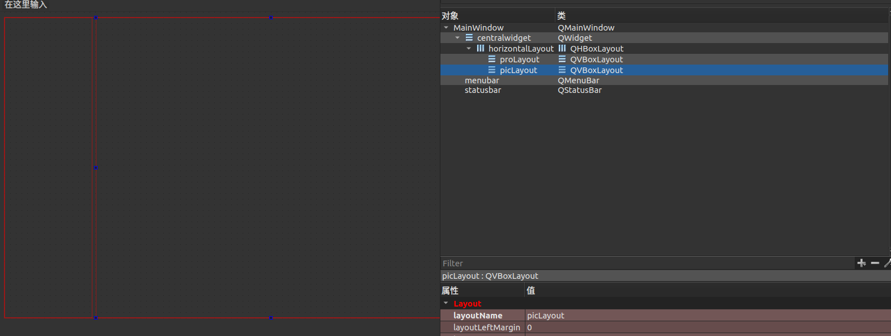
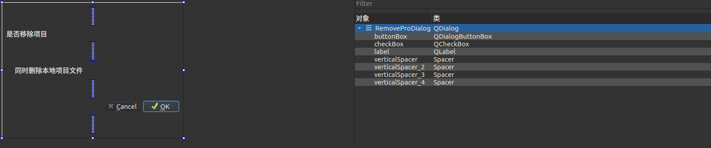
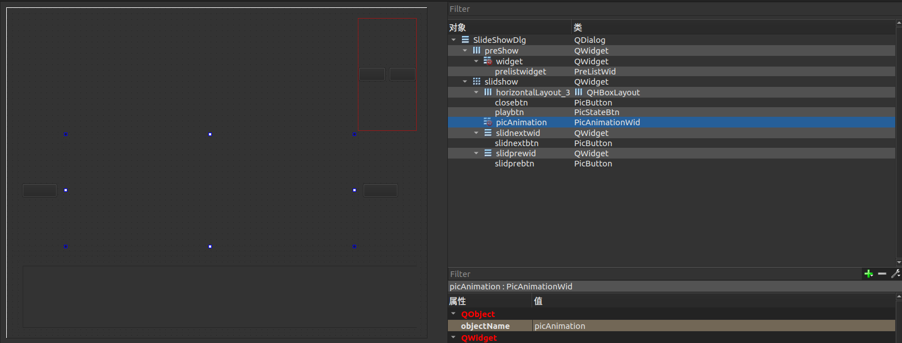
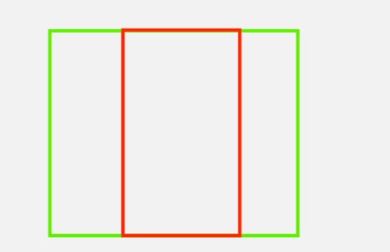

[toc]

本篇主要总结QT电子相册项目 

# 项目配置部分
在本项目中涉及到

qt资源包  qss风格设置 qtMedia设置

在cmake中对应

## 在qt项目中添加图像资源
```cmake
set(QRC_SOURCE_FILES Resources/rc.qrc)
qt5_add_resources(QRC_FILES ${QRC_SOURCE_FILES})
```

在qt项目中添加qt->资源类 结尾为qrc的文件 然后再qtcreater中点添加文件 直接导入即可 这样在qt项目中就可以调用qrc中的图像路径

## qss风格设置:
qss本身和css的语法相似，可以参考项目中qss的配置
例如 对SlideShowDlg背景窗口设置，对slidprebtns这些btn的设置
```css
SlideShowDlg {
    color:rgb(46,47,48);
    background-color:rgb(46,47,48);
}
#slidprebtns,#slidnextbtn,#closebtn,#playbtn{
    border: 0px;
}
```

在项目中导入qss设置 在main函数中设置
```c++
 //添加qss设置  使用qstring的方式读取并将其设置给整个window
    QFile qss(":/style/style.qss");
    if(qss.open(QFile::ReadOnly)){
        qDebug() << "Open qss success";
        QString style = QLatin1String(qss.readAll());
        a.setStyleSheet(style);
        qss.close();
    }
    else{
        qDebug()<<"open qss filed";
        return 0;
    }
```

## qtMedia设置
在项目中需要播放音频
在cmake中我们使用的方式调用多媒体的方式
```cmake
find_package(Qt5 COMPONENTS Widgets Multimedia REQUIRED)
target_link_libraries(QT_E_albums PRIVATE Qt5::Widgets Qt5::Multimedia)
```
而在程序中(protreewidgt)我们实现了多媒体播放
```c++
#include <QtMultimedia/QMediaPlayer>
#include <QtMultimedia/QMediaPlaylist>


//多媒体播放器
QMediaPlayer* _player;
//多媒体播放列表
QMediaPlaylist * _playerlist;

//初始化
_player = new QMediaPlayer(this);
_playerlist = new QMediaPlaylist(this);
_playerlist->setPlaybackMode(QMediaPlaylist::Loop);
_player->setPlaylist(_playerlist);
```

在mainwindow的菜单栏中我们设置了任务"背景音乐",并将这个触发函数让其调用protreewidget.cpp中的SlotSetMusic函数 出发音乐设置
```c++
//mainwindow.cpp
    QAction* act_music = new QAction(QIcon(":/icon/music.png"),tr("背景音乐"),this);
    act_music->setShortcut(QKeySequence(Qt::CTRL + Qt::Key_M));
    menu_set->addAction(act_music);
      //音乐播放和打开
    connect(act_music,&QAction::triggered,
            pro_tree_widget,&ProTreeWidget::SlotSetMusic);
            
```
在protreewidget.cpp中，首先会打开一个file_dialog用来选择文件，在选择一个文件后会检查这个文件夹下的文件的数量是否大于，然后会将这个文件夹下以mp3结尾的文件都设置到_playerlist中去

之后判断这个媒体源是不是正在播放，不是就设置为可激活(播放)状态
```c++
//protreewidget.cpp
void ProTreeWidget::SlotSetMusic() {
    QFileDialog file_dialog;
    file_dialog.setFileMode(QFileDialog::ExistingFiles);
    file_dialog.setWindowTitle(tr("选择导入音频文件"));
    file_dialog.setDirectory(QDir::currentPath());
    file_dialog.setViewMode(QFileDialog::Detail);
    file_dialog.setNameFilter("(*.mp3)");
    QStringList filesNames;
    if(file_dialog.exec()){
        filesNames = file_dialog.selectedFiles();
    }
    else{
        return;
    }
    if(filesNames.length() <= 0 ){
        return;
    }
    _playerlist->clear();
    for(auto filename : filesNames){
        if(filename.endsWith(".mp3")){
            _playerlist->addMedia(QUrl::fromLocalFile(filename));
        }
    }
    if(_player->state() != QMediaPlayer::PlayingState){
        _playerlist->setCurrentIndex(0);
    }
}
```
而在幻灯片播放动画class picanimationwid 中，设置背景音乐信号
而在启动/关闭动画的时候发送音乐开启关闭信号

在幻灯片窗口slidshowdlg中告诉prowidghtree对应SlotStartMusic/SlotStopMusic两个函数 控制音乐的开启/关闭
```c++
//PicAnimationWid
    void SigStartMusic();
    void SigStopMusic();
    void PicAnimationWid::start(){
        emit SigStart();
        emit SigStartMusic();
        _factor = 0.0;
        _timer->start(5);
        _b_start = true;
    }
    void PicAnimationWid::stop() {
        emit SigStop();
        emit SigStopMusic();
        _timer->stop();
        _factor = 0.0;
        _b_start = false;
    }
//slidshowdlg
    connect(ui->picAnimation,&PicAnimationWid::SigStartMusic,
            _protree_widget,&ProTreeWidget::SlotStartMusic);
    connect(ui->picAnimation,&PicAnimationWid::SigStopMusic,
            _protree_widget,&ProTreeWidget::SlotStopMusic);
//protreewidget
    void ProTreeWidget::SlotStartMusic(){
        if(_player == nullptr){
            return;
        }
        _player->play();
    }

    void ProTreeWidget::SlotStopMusic(){
        if(_player == nullptr){
            return;
        }
        _player->stop();
    }
```


# 具体介绍


## mainwindow 主窗口 设置 
在ui中左侧设置文件字典目录piclayout 右侧设置图片显示prolayout 两者都是垂直布局layout显示
左右比列设置为1:4 （在二者的公共父类中设置layoutsizeconst）



在mainwindow窗口中设置菜单栏，在菜单栏中menu_file，在menu_file中增加选项:文件、设置，文件选项下绑定创建项目、打开项目两个qaction 设置下绑定背景音乐选项

```c++
    //创建菜单
    QMenu* menu_file = menuBar()->addMenu(tr("文件(&F)"));
    //创建项目动作
    QAction* act_create_pro = new QAction(QIcon(":/icon/createpro.png"), tr("创建项目"),this);
    //设置快捷键
    act_create_pro->setShortcut(QKeySequence(Qt::CTRL + Qt::Key_N));
    menu_file->addAction(act_create_pro);

    //打开项目动作
    QAction* act_open_pro = new QAction(QIcon(":/icon/openpro.png"),tr("打开项目"),this);
    act_open_pro->setShortcut(QKeySequence(Qt::CTRL + Qt::Key_O));
    menu_file->addAction(act_open_pro);

    //创建项目设置菜单
    QMenu* menu_set = menuBar()->addMenu(tr("设置(&S)"));
    //背景音乐设置
    QAction* act_music = new QAction(QIcon(":/icon/music.png"),tr("背景音乐"),this);
    act_music->setShortcut(QKeySequence(Qt::CTRL + Qt::Key_M));
    menu_set->addAction(act_music);
```

我们一次介绍每一种功能

###  创建项目 和 protree  wizard

创建项目绑定槽函数MainWindow::SlotCreatePro
在这个函数中会创建一个(自定义的wizard)wizard，wizard继承QWizard，这是一个选择进度对话框
```c++
void MainWindow::SlotCreatePro(bool checked)
{
    Wizard wizard(this);
    wizard.setWindowTitle(tr("创建项目"));
    auto * page = wizard.page(0);
    page->setTitle(tr("设置项目配置"));
    //连接信号和槽 把项目配置传回来 并通过connect告诉文件目录类ProTree按照回传的path、name添加item
    connect(&wizard,&Wizard::SigProSettings,
            dynamic_cast<ProTree*>(_protree),&ProTree::AddProTree);
    wizard.show();
    wizard.exec();
    //断开所有信号
    disconnect(&wizard);
}
```
<font color=red>这里使用一个技巧 让wizard和protree两个没有关系的类通过mainwindow这个class中存在的protree对象_protree连接起来，实现当wizard发出信号而protree响应</font>


#### wizard和prosetpage 和 confirmpage 

在QWizard中，默认有两个页面QWizardPage，用来做选项，即第一页选择路径、名称，第二页显示一些信息。

<font color=red>这里使用一个技巧 在wizard界面中有两个ui，在qcreator中选择界面 选择提升为 将第一个界面绑定为prosetpage，第二个界面绑定为confirmpage ，这两个class都是继承于QWizardPage的自定义实现类，这样我们通过继承的方式将QWizard的两个进行了重写</font>

##### prosetpage 选择创建项目路径和项目名称界面

这个界面中实际上是由两个lable和对应的lineedit构成
也就是name path以及对应的lineEdit 用户在两个对应的lineEdit中输入
```c++
ui->setupUi(this);
    //将两个lineEdit注册为wizard的field，保证两个lineEdit是空的时候无法点击下一步
    registerField("proName",ui->lineEdit);
    registerField("proPath",ui->lineEdit_2);
    //将QLineEdit的textEdited信号和ProSetPage的completeChanged信号连接起来，
    //这样在lineEdit编辑的时候就会发送textEdited信号，进而触发ProSetPage发送completeChanged信号。
    connect(ui->lineEdit,&QLineEdit::textEdited,this,&ProSetPage::completeChanged);
    connect(ui->lineEdit_2,&QLineEdit::textEdited,this,&ProSetPage::completeChanged);

    ui->lineEdit->setText("Input name");
    ui->lineEdit->setClearButtonEnabled(true);
    //获取当前路径
    QString curPath = QDir::currentPath();
    //将当前路径作为默认值放到text里
    ui->lineEdit_2->setText(curPath);
    ui->lineEdit_2->setCursorPosition(ui->lineEdit_2->text().size());
    //添加一键删除按钮
    ui->lineEdit_2->setClearButtonEnabled(true);
```
在path右侧我们设置一个预览的按键，并设置其槽函数on_pushButton_clicked
```c++
void ProSetPage::on_pushButton_clicked()
{
    QFileDialog file_dialog;
    file_dialog.setFileMode(QFileDialog::Directory);
    file_dialog.setWindowTitle("选择导入的文件夹");
    auto path = QDir::currentPath();
    file_dialog.setDirectory(path);
    file_dialog.setViewMode(QFileDialog::Detail);

    QStringList fileNames;
    if(file_dialog.exec()){
        fileNames = file_dialog.selectedFiles();
    }
    if(fileNames.size() < 0){
        return ;
    }
    QString import_path = fileNames.at(0);
    qDebug()<<"Imort_path is "<< import_path << endl;
    ui->lineEdit_2->setText(import_path);
}
```
在点击这个函数后会打开一个file_dialog，我们通过选择路径将其设置到path的lineedit(ui->lineEdit_2)中

同时我们重写了QWizardPage的虚函数isComplete，用来判断用户选择的文件和名称是否合理
```c++
bool ProSetPage::isComplete() const
{
    if(ui->lineEdit->text() == "" || ui->lineEdit_2->text() == ""){
        return false;
    }
    QDir dir(ui->lineEdit_2->text());
    //如果path已经存在 就设置ui->tips显示问题 并返回false
    if(!dir.exists()){
        ui->tips->setText("project path is not extits");
        return false;
    }
    QString absFilePath = dir.absoluteFilePath(ui->lineEdit->text());
    //如果path  + name 已经存在 就设置ui->tips显示问题 并返回false
    QDir dist_dir(absFilePath);
    if(dist_dir.exists()){
        ui->tips->setText("project has exits,change path or name!");
        return false;
    }
    ui->tips->setText("ok!");
    //自己实现qt的虚函数的时候,为了防止原本功能的被覆盖，这里需要调用旧的函数
    return QWizardPage::isComplete();
}
```

<font color=red>这里需要注意一个技巧，在我们使用重写的虚函数的时候，在写完我们自己的功能后，需要在跑原本的函数，避免有功能因为重写被覆盖</font>


#####  confirmpage 
确认界面   ui中显示已经生成完成

#####  wizard done操作重写
在wizard中 我们重写done操作 获取page1中用户设定的项目名称和path，并将这两条数据作为信号函数发送出去
```c++
void Wizard::done(int result)
{
    if(result == QDialog::Rejected){
        return QWizard::done(result);
    }
    QString name,path;
    ui->wizardPage1->GetProSettings(name,path);
    emit SigProSettings(name,path);
    QWizard::done(result);
}
```
在mainwindow中一但接受到SigProSettings信号 ，就执行ProTree::AddProTree
```c++
    //连接信号和槽 把项目配置传回来 并通过connect告诉文件目录类ProTree按照回传的path、name添加item
    connect(&wizard,&Wizard::SigProSettings,
            dynamic_cast<ProTree*>(_protree),&ProTree::AddProTree);
```
<font color=red>这里使用一个技巧 让wizard和protree两个没有关系的类通过mainwindow这个class中存在的protree对象_protree连接起来，实现当wizard发出信号而protree响应</font>

#### protree的设计
protree是一个文件显示ui 里头有QTreeWidget存储文件信息以及一个label标注   

同样的 使用提升的方式 将默认的基类QTreeWidget 提升为 ProTreeWidget

这里直接通过调用ui调用自定义类的AddProToTree方法
```c++
void ProTreeWidget::AddProToTree(const QString &name, const QString &path)
{
    QDir dir(path);
    QString file_path = dir.absoluteFilePath(name);
    if(_set_path.find(file_path) != _set_path.end()){
        return ;
    }
    QDir pro_dir(file_path);
    if(!pro_dir.exists()){
        bool enable = pro_dir.mkpath(file_path);
        if(!enable){return ;}
    }
    _set_path.insert(file_path);
    auto *item = new ProTreeItem(this,name,file_path,TreeItemPro);
    item->setData(0,Qt::DisplayRole,name);
    item->setData(0,Qt::DecorationRole,QIcon(":/icon/dir.png"));
    item->setData(0,Qt::ToolTipRole,file_path);
    this->addTopLevelItem(item);
}
```

首先获取name和path构成的项目文件  并将其添加到ProTreeWidget中维护的一个哈希表中 ，防止重复引用。创建文件夹，同时创建QTreeWidget的一个元素QTreeWidgetItem(这里也通过继承的方式实现自定义为ProTreeItem的item)，将item加入到树的头部

由于在mainwindow的创建时就已经把mainwindow中的proLayout中添加了一个（QTreeWidget）_protree **为了减少混乱，这里定义的时候还是用用父类指针QWidget** 
。
所以当wizard完成时会发送信号，通过protree中ui接受调用ProTreeWidget::AddProToTree的方式实现创建将文件夹引入到mainwindow中的prolayout来
```c++
//mainwindow.cpp

//在ui->proLayout中添加目录
_protree = new ProTree();
ui->proLayout->addWidget(_protree);
```


#### ***protreewidget 文件目录树基类

##### 成员介绍
作为文件列表中最终要的一环 ，这个class函数也是继承了非常多的功能，其继承于QTreeWidget

首先说明几个关键变量
```c++
 //判断是否重名 hash
QSet<QString>_set_path;
//鼠标右键的条目元素 -- 项目文件夹的item
QTreeWidgetItem * _right_btn_item;
//保存当前启动项目的元素
QTreeWidgetItem * _active_item;
//保存选中条目元素 -- 删除时使用
QTreeWidgetItem * _select_item;
//菜单栏中的四类活动函数
QAction* _action_import;
QAction* _action_setstart;
QAction* _action_closepro;
QAction* _action_slideshow;
//进度对话框
QProgressDialog * _dialog_progress;
//打开项目文件进度框
QProgressDialog* _open_progressdlg;
//使用智能指针管理创建文件的线程
std::shared_ptr<ProTreeThread>_thread_create_pro;
//使用智能指针管理打开文件的线程
std::shared_ptr<OpenTreeThead>_thread_open_pro;
//使用智能指针管理滑动播放窗口
std::shared_ptr<SlideShowDlg> _slide_show_dlg;
```


##### item重写  -- protreeitem

同样使用集成重载的方式 使用ProTreeItem类来继承QTreeWidgetItem class

为了方便后续可以向前向后选择图片，将ProTreeItem的数据结构设计为一个双向链表
双线链表只连接图片的item，并不链接项目pro和文件dir，例如

实现一下功能
```c++
    //获取名字
    const QString &Getname() const;
    //获取path
    const QString &Getpath() const;
    //获取根节点 也就是属于那个项目节点
    QTreeWidgetItem *Getroot() const;
    //设置前向节点
    void SetPreItem(QTreeWidgetItem* pre_item);
    //设置后向节点
    void SetNextItem(QTreeWidgetItem* next_item);
    //获取前向节点
    ProTreeItem* GetPreItem();
    //获取后向节点
    ProTreeItem* GetNextItem();
    //获取最后一个图的item -- 用于伦播
    ProTreeItem* GetLastPicChild();
    //获取第一个图的item -- 用于轮播
    ProTreeItem* GetFirstPicChild();
```

##### 具体功能介绍

```c++
_action_import = new QAction(QIcon(":/icon/import.png"),tr("导入文件"),this);
_action_setstart = new QAction(QIcon(":/icon/core.png"),tr("设置活动项"),this);
_action_closepro = new QAction(QIcon(":/icon/close.png"),tr("关闭项目"),this);
_action_slideshow = new QAction(QIcon(":/icon/slideshow.png"),tr("轮播图播放"),this);
//--------------------------------事件绑定 -----------------------------------
connect(_action_import,&QAction::triggered,this,&ProTreeWidget::SlotImport);
connect(_action_setstart,&QAction::triggered,this,&ProTreeWidget::SlotSetActive);
connect(_action_closepro,&QAction::triggered,this,&ProTreeWidget::SlotCloseActive);
//双击weightitem的时候发送信号 用来进行双击显示图像
connect(this,&ProTreeWidget::itemDoubleClicked,this,&ProTreeWidget::SlotDoubleClickedItem);

//轮播图播放
connect(_action_slideshow,&QAction::triggered,this,&ProTreeWidget::SlotSlidShow);
```


###### 1.介绍右键弹出菜单的功能

对于这个自定义的QTreeWidget 我们首先让其实现点击项目右侧展开一个菜单，用来对项目操作:
```c++
//Protreewidget.cpp
 //右键点击生成操作菜单
    connect(this,&ProTreeWidget::itemPressed,this,&ProTreeWidget::SlotItemPressed);

void ProTreeWidget::SlotItemPressed(QTreeWidgetItem *pressedItem, int column)
{
    //使用QGuiApplication监听 如果当前是鼠标事件 - 右键
    if(QGuiApplication::mouseButtons() == Qt::RightButton){
        QMenu menu(this);
        int itemtype = pressedItem->type();
        if(itemtype == TreeItemPro){
            //_right_btn_item 记录了当前鼠标右键点击的元素 作为父节点传入 这里存储的是项目item
            _right_btn_item = pressedItem;
            menu.addAction(_action_import);
            menu.addAction(_action_setstart);
            menu.addAction(_action_closepro);
            menu.addAction(_action_slideshow);
            menu.exec(QCursor::pos());
        }
    }
}
```
对于这四个QAction 是class私有成员，在构造函数中就会体现：
```c++
_action_import = new QAction(QIcon(":/icon/import.png"),tr("导入文件"),this);
_action_setstart = new QAction(QIcon(":/icon/core.png"),tr("设置活动项"),this);
_action_closepro = new QAction(QIcon(":/icon/close.png"),tr("关闭项目"),this);
_action_slideshow = new QAction(QIcon(":/icon/slideshow.png"),tr("轮播图播放"),this);
//--------------------------------事件绑定 -----------------------------------
connect(_action_import,&QAction::triggered,this,&ProTreeWidget::SlotImport);
connect(_action_setstart,&QAction::triggered,this,&ProTreeWidget::SlotSetActive);
connect(_action_closepro,&QAction::triggered,this,&ProTreeWidget::SlotCloseActive);
//双击weightitem的时候发送信号 用来进行双击显示图像
connect(this,&ProTreeWidget::itemDoubleClicked,this,&ProTreeWidget::SlotDoubleClickedItem);

//轮播图播放
connect(_action_slideshow,&QAction::triggered,this,&ProTreeWidget::SlotSlidShow);
```

我们首先介绍和导入文件相关的_action_import操作
其调用SlotImport函数，在Qt中，我们是按照响应的方式实现通信，如果导入文件过大，会阻塞主线程运行。所以这里会使用一个QThread另外启动一个线程来进行文件导入


当然我们使用**重载**的方式实现一个QThread来实现加载文件
```c++
std::shared_ptr<ProTreeThread>_thread_create_pro;
```

在SlotImport中 核心是创建_thread_create_pro 将信息传给线程类ProTreeThread，并且通过start的方式开启线程

##### *****protreethread 多线程调用递归导入文件夹内数据

<font color=red>在qt中对于自定义的线程，线程函数的设置在run函数中重写</font>

```c++
void ProTreeThread::run() {
    QTreeWidgetItem* pre_item = nullptr;
    CreateProTree(_src_path,_dis_path,
            _parent_item,_file_count,_self,_root,pre_item);
    if(_bstop){
        auto path = dynamic_cast<ProTreeItem*>(_root)->Getpath();
        //查询当前的index节点 将其在dialog中删除
        auto index = _self->indexOfTopLevelItem(_root);
        delete _self->takeTopLevelItem(index);
        //如果是拷贝了一半就点击了删除，就将这个创建的文件夹删除
        QDir dir(path);
        dir.removeRecursively();
        return;
    }
    emit SigFinishProgress(_file_count);
}
```

其中关键的是调用的CreateProTree函数来递归的导入文件
考虑如何要递归

一个项目文件，里面可能既存在图片又存在子文件夹，子文件夹下又可能有图和子文件夹，所以在打开项目读取文件下的数据的时候，就需要递归 如果是子文件夹 ，就递归到子文件夹下读取

具体实现如下:

**<font color=red>这里非常重要，请认真阅读这个函数</font>**
```c++
//创建目录树  pre_item: 当前链表中的前一个节点
void ProTreeThread::CreateProTree(const QString &src_path, const QString &dis_path,
        QTreeWidgetItem *parent_item, int &file_count, QTreeWidget *self,
        QTreeWidgetItem *root, QTreeWidgetItem * &pre_item)
{
    if(_bstop){
        return;
    }
    //判断是否需要拷贝 -- 如果srcpath dispath是否相同 相同就不拷贝
    bool needcopy = true;
    if(src_path == dis_path){
        needcopy = false;
    }
    QDir import_dir(src_path);

    //设置过滤器
    QStringList nameFilters;
    //除了. .. 获取文件夹、文件名称
    import_dir.setFilter(QDir::Dirs | QDir::Files | QDir::NoDotAndDotDot);
    import_dir.setSorting(QDir::Name);
    //获取过滤结束后的结果
    QFileInfoList list = import_dir.entryInfoList();
    //遍历
    for(int i=0;i<list.size();++i){
        if(_bstop){
            return;
        }
        QFileInfo fileInfo = list.at(i);
        //这里取出的内容可能是文件夹 也可能是文件 所以需要判断是否是文件夹，如果是文件夹就还需要继续向下递归
        bool bIsDir = fileInfo.isDir();
        if(bIsDir){
            if(_bstop){
                return;
            }
            file_count++;
            emit SigUpdateProgress(file_count);
            //获取目的路径下和源文件夹相应的位置 方便下一轮递归调用
            QDir dist_dir(dis_path);
            QString sub_dist_path = dist_dir.absoluteFilePath(fileInfo.fileName());
            QDir sub_dist_dir(sub_dist_path);
            //如果子文件夹下没有 就创建
            if(!sub_dist_dir.exists()){
                if(!sub_dist_dir.mkpath(sub_dist_path)){
                    qDebug()<< "sub_dist_dir mkpath failed"<< endl;
                    continue;
                }
            }
            //创建这个文件夹的item
            auto * item = new ProTreeItem(parent_item,fileInfo.fileName(),
                    sub_dist_path,root,TreeItemDir);
            item->setData(0,Qt::DisplayRole,fileInfo.fileName());
            //图标
            item->setData(0,Qt::DecorationRole,QIcon(":/icon/dir.png"));
            //提示 文件的路径
            item->setData(0,Qt::ToolTipRole,sub_dist_path);
            //递归调用  pre_item 连接的是图像 所以这里不会更新pre_item
            //这里传递的是指针的引用 所以同一个项目下子文件夹下的图片会和子文件外的图片产生链表连接
            CreateProTree(fileInfo.absoluteFilePath(),sub_dist_path,
                    item,file_count,self,root,pre_item);
        }
        //如果是文件
        else{
            if(_bstop){
                return;
            }
            //获取文件后缀 通过后缀判断是不是图像文件
            //注:qt原版的获取后缀有问题 原版是从前向后查找第一个.标志的 当文件中有如111.11.jpg 后缀将无法匹配
            //const QString& suffix = fileInfo.completeSuffix();
            QString suffix = this->cal_completeSuffix(fileInfo.fileName());
            if(suffix != "png" && suffix!="jpg" && suffix!="jpeg"){
                continue;
            }
            //如果是图片文件 就进行copy copy过程前先对文件计数++
            file_count++;
            //通知外界文件数量更新
            emit SigUpdateProgress(file_count);
            if(!needcopy){ continue;}
            //如果需要拷贝 先创建文件夹
            QDir dist_dir(dis_path);
            //拼接 形成新的路径 返回文件的绝对位置+文件名
            QString dist_file_path = dist_dir.absoluteFilePath(fileInfo.fileName());
            //判断是否拷贝成功
            if(!QFile::copy(fileInfo.absoluteFilePath(),dist_file_path)){
                continue;
            }

            auto * item = new ProTreeItem(parent_item,fileInfo.fileName(),
                    dist_file_path,root,TreeItemPic);
            item->setData(0,Qt::DisplayRole,fileInfo.fileName());
            //图标
            item->setData(0,Qt::DecorationRole,QIcon(":/icon/pic.png"));
            //提示 文件的路径
            item->setData(0,Qt::ToolTipRole,dist_file_path);

            //如果有前节点 需要将其连接
            if(pre_item){
                auto * pre_proitem = dynamic_cast<ProTreeItem*>(pre_item);
                pre_proitem->SetNextItem(item);
            }
            item->SetPreItem(pre_item);
            //更新pre_item 让其指向最后一位(始终在插入节点的前一位)
            pre_item = item;
        }
    }
}
```
我们注意到 当file_count增加的时候，就会向外发送SigUpdateProgress
当执行结束 会在run函数中发送SigFinishProgress信号

##### ****读取导入文件时进度条如何实现 (番外) 

以上两个信号都会被protreewidget中管理的进度对话框   QProgressDialog * _dialog_progress接受
```c++
void ProTreeWidget::SlotUpdateProgress(int count){
    //检查这个对话框是否存在 不存在说明点击关闭了 就不会做相应了
    if(!_dialog_progress){
        return;
    }
    //如果当前count比这个值大 就将其设置为99%
    if(count >= PROGRESS_MAX_WIDTH){
        _dialog_progress->setValue(PROGRESS_MAX_WIDTH-1);
    }
    //小于就直接设置
    else{
        _dialog_progress->setValue(count);
    }
}
void ProTreeWidget::SlotFinishProgress() {
    if(_dialog_progress == nullptr){
        return;
    }
    //一旦拷贝完成 就将进度条更新为满
    _dialog_progress->setValue(PROGRESS_MAX_WIDTH);
    //释放对话框
    _dialog_progress->deleteLater();
}
```
QProgressDialog是qt封装的一个进度条处理对话框，里头有一个对话框和一个取消按钮

```c++
//添加取消槽函数 当点击取消的时候就会发送cancel消息
connect(_dialog_progress,&QProgressDialog::canceled,
        this,&ProTreeWidget::SlotCancelProgress);
//接受到取消信号后 线程就会执行函数
connect(this,&ProTreeWidget::SigCancelProgress,
        _thread_create_pro.get(),&ProTreeThread::SlotCancelProgress);
```
当点击取消的时候，会触发QProgressDialog::canceled事件，进而触发SlotCancelProgress函数
```c++
void ProTreeWidget::SlotCancelProgress() {
    //发送对话框取消信号 这个信号使用来通知线程 告诉线程已经取消
    emit SigCancelProgress();
    if(_dialog_progress!=nullptr){
        delete _dialog_progress;
        _dialog_progress == nullptr;
    }
}
```
而接受到SigCancelProgress会告诉触发线程的取消函数
```c++
void ProTreeThread::SlotCancelProgress() {
    _bstop = true;
}
```

### 打开文件

打开的功能和导入文件功能相似
在mainwindow中会触发ProTreeWidget::SlotOpenPro函数
```c++
//连接打开项目信号
connect(this,&MainWindow::SigOpenPro,
        pro_tree_widget,&ProTreeWidget::SlotOpenPro);
```

在SlotOpenPro函数中和SlotImport函数是相似的，创建了打开文件的线程_thread_open_pro，并通过递归的方式导入，通过_open_progressdlg创建进度条对话框，并绑定更新进度、完成任务、取消任务的槽函数 这里具体阅读ProTreeWidget::SlotOpenPro即可 不再赘述


###  设置活动项 -- 点击高亮/加粗设置

目的是实现当点击右侧项目item的时候，将字体实现高亮/加粗，这里通过将_action_setstart和ProTreeWidget::SlotSetActive绑定实现

这里使用QFont来实现字体格式的更新
```c++
//设置活动项的槽函数
void ProTreeWidget::SlotSetActive(){
    //检查此时项目文件是否有
    if(!_right_btn_item){
        return;
    }
    QFont nullFont;
    //是否加粗 - false
    nullFont.setBold(false);
    //如果之前激活过了 就将字体设置为普通字体
    if(_active_item){
        _active_item->setFont(0,nullFont);
    }
    _active_item = _right_btn_item;
    nullFont.setBold(true);
    _active_item->setFont(0,nullFont);
}
```

## 右键项目名称在弹出菜单中的操作(导入文件在前面) 

### 关闭项目

关闭打开的项目，并且需要弹出一个弹窗提醒用户是否要删除这个项目
将_action_closepro和ProTreeWidget::SlotCloseActive绑定实现


首先创建一个关闭提示窗口RemoveProDialog 继承自 QDialog
在RemoveProDialog

这个ui中添加一个QCheckBox来描述是否删除本地文件



在RemoveProDialog中使用一个函数来记录是否选择删除
```c++
bool RemoveProDialog::IsRemove()
{
    bool bChecked = ui->checkBox->isChecked();
    return bChecked;
}
```
ProTreeWidget中获取到删除的信息后会额外执行删除文件任务，注意删除任务执行后需要将当前的_right_btn_item更新为空，直到点击其他项目触发选择事件或者导入新的项目
```c++
void ProTreeWidget::SlotCloseActive() {
    RemoveProDialog remove_pro_dialog;
    auto res = remove_pro_dialog.exec();
    //如果没有接受到对话框信息，就返回
    if (res != QDialog::Accepted) {
        return;
    }
    //获取是否删除元素
    bool b_remvoe = remove_pro_dialog.IsRemove();
    //获取右键点击元素的索引 -- 删除元素
    auto index_right_btn = this->indexOfTopLevelItem(_right_btn_item);
    //获取当前右键的条目
    auto *protreeitem = dynamic_cast<ProTreeItem *>(_right_btn_item);
    auto *selecteditem = dynamic_cast<ProTreeItem *>(_select_item);
    //获取右键条目的路径
    auto delete_path = protreeitem->Getpath();
    //在记录文件的哈希表中删除元素
    _set_path.remove(delete_path);
    if (b_remvoe) {
        QDir delete_dir(delete_path);
        delete_dir.removeRecursively();
    }
    //如果当前删除条目和激活条目是同一个 就将激活条目置位为空
    if (protreeitem == _active_item) {
        _active_item == nullptr;
    }
    //在关闭项目的时候 需要添加选择 判断如果此时右侧窗口正在播放图片，此时要关闭了项目 就需要同住显示端
    if(selecteditem!=nullptr && protreeitem!=nullptr && protreeitem == selecteditem->Getroot()) {
        selecteditem = nullptr;
        _select_item = nullptr;
        emit SigClearSelected();
    }

    //在窗口删除 并且删除右键指向
    delete this->takeTopLevelItem(index_right_btn);
    _right_btn_item = nullptr;
}
```
在关闭项目的时候 需要添加选择 判断如果此时右侧窗口正在播放图片，此时要关闭了项目 就需要发送SigClearSelected信号，由mainwindow接受，执行PicShow::SlotClearItem

这里将_selected_path置空 这样向前向后就找不到前后项目了 
```c++
void PicShow::SlotClearItem(){
    _selected_path = "";
}
```

### ***** 轮播图播放

为了实现轮播图播放功能，首先设计了一个slidshowdlg窗口


其中我们封装了向前向后的点击btn **PicButton** 提升替换closebtn、slidnextbtn、slidprebtn ;    **PicStateBtn**提升替换playBtn;并且使用一个高度固定 宽度无限大(16777215长度的)**PreListwid**(没错也是自定义的)，在幻灯片动画轮播区域 设置**PicAnimationWid**实现显示

#### PicButton自定义向前向后关闭图标
我们一个一个说 首先介绍PicButton，继承于QPushButton，在按键中我们加载三个路径
```c++
//正常加载图片路径
QString _normal;
//悬浮加载图片路径
QString _hover;
//点击加载图片路径
QString _pressed;


void PicButton::SetIcon(const QString &normal, const QString &hover, const QString &pressed) {
    _normal = normal;
    _hover = hover;
    _pressed = pressed;

    QPixmap tmpPixmap;
    tmpPixmap.load(normal);
    this->resize(tmpPixmap.width(), tmpPixmap.height());
    this->setIcon(tmpPixmap);
    this->setIconSize(tmpPixmap.size());
}
```

并且实现三个路径的加载函数
```c++
void PicButton::setNormalIcon(){
    QPixmap tmpPixmap;
    tmpPixmap.load(_normal);
    this->resize(tmpPixmap.width(), tmpPixmap.height());
    this->setIcon(tmpPixmap);
    this->setIconSize(tmpPixmap.size());
}
void PicButton::setHoverIcon(){
    QPixmap tmpPixmap;
    tmpPixmap.load(_hover);
    this->resize(tmpPixmap.width(), tmpPixmap.height());
    this->setIcon(tmpPixmap);
    this->setIconSize(tmpPixmap.size());
}
void PicButton::setPressedIcon(){
    QPixmap tmpPixmap;
    tmpPixmap.load(_pressed);
    this->resize(tmpPixmap.width(), tmpPixmap.height());
    this->setIcon(tmpPixmap);
    this->setIconSize(tmpPixmap.size());
}
```

同时我们重载虚函数event 判断当前鼠标状态:
如果鼠标是进入 就是悬浮状态图标 如果是离开就恢复为正常图标
如果是点击就是点击状态 如果是鼠标松开 就要恢复成悬浮状态

```c++
bool PicButton::event(QEvent *event){
    switch (event->type()){
        case QEvent::Enter:
            setHoverIcon();
            break;
        case QEvent::Leave:
            setNormalIcon();
            break;
        case QEvent::MouseButtonPress:
            setPressedIcon();
            break;
        case QEvent::MouseButtonRelease:
            setHoverIcon();
            break;
        default:
            break;
    }
    return QPushButton::event(event);
}
```
同时在qss中设置无边框显示
```css
#slidprebtns,#slidnextbtn,#closebtn,#playbtn{
    border: 0px;
}
```
这样就实现了这些按钮鼠标移入一个图标 移出一个图标 点击和释放一个图标


#### PicStateBtn自定义播放图标
由于播放和暂停是两个不同的图标，所以就要设置六种状态
```c++
//播放状态图标的正常、悬浮、点击图标
QString _normal;
QString _hover;
QString _pressed;
//暂停状态图标的正常、悬浮、点击图标
QString _normal_2;
QString _hover_2;
QString _pressed_2;

void PicStateBtn::SetIcons(const QString& normal,const QString& hover,const QString& pressed,
                                const QString& normal_2,const QString& hover_2,const QString& pressed_2){
    _normal = normal;
    _hover = hover;
    _pressed = pressed;

    _normal_2 = normal_2;
    _hover_2 = hover_2;
    _pressed_2 = pressed_2;

    QPixmap tmpPixmap;
    tmpPixmap.load(normal);
    this->resize(tmpPixmap.width(),tmpPixmap.height());
    this->setIcon(tmpPixmap);
    this->setIconSize(tmpPixmap.size());
    //设置当前状态
    _cur_state = PicBtnStateNormal;
}

//同时在共用设置头文件const.h中设置
//const.h
enum PicBtnState {
    PicBtnStateNormal = 1,
    PicBtnStateHover = 2,
    PicBtnStatePressed = 3,

    PicBtnState2Normal = 4,
    PicBtnState2Hover = 5,
    PicBtnState2Pressed = 6,
};
```

同时重载event事件
_cur_state < PicBtnState2Normal 表示当前状态是1-3，也就是播放状态
```c++
bool PicStateBtn::event(QEvent *event){
    switch (event->type()){
        case QEvent::Enter:
            //判断是否是播放图标 加载播放图标的悬浮状态
            if (_cur_state < PicBtnState2Normal){
                setHoverIcon();
            }
            //此时是暂停图标 加载暂停图标的悬浮状态
            else{
                setHover2Icon();
            }
            break;
        case QEvent::Leave:
            //判断是否是播放图标 加载播放图标的悬浮状态
            if (_cur_state < PicBtnState2Normal){
                setNormalIcon();
            }
                //此时是暂停图标 加载暂停图标的悬浮状态
            else{
                setNormal2Icon();
            }
            break;
        case QEvent::MouseButtonPress:
            //判断是否是播放图标 加载播放图标的悬浮状态
            if (_cur_state < PicBtnState2Normal){
                setPressedIcon();
            }
                //此时是暂停图标 加载暂停图标的悬浮状态
            else{
                setPressed2Icon();
            }
            break;
        case QEvent::MouseButtonRelease:
            //判断是否是播放图标 加载播放图标的悬浮状态
            if (_cur_state < PicBtnState2Normal){
                setHoverIcon();
            }
                //此时是暂停图标 加载暂停图标的悬浮状态
            else{
                setHover2Icon();
            }
            break;
        default:
            break;
    }
    return QPushButton::event(event);
}
```


在slidshowdlg中设置这几个btn，同时导入path
```c++
//加载图标
ui->slidprebtn->SetIcon(":/icon/previous.png",
        ":/icon/previous_hover.png",":/icon/previous_press.png");
ui->slidnextbtn->SetIcon(":/icon/next.png",
                            ":/icon/next_hover.png",":/icon/next_press.png");
ui->closebtn->SetIcon(":/icon/closeshow.png",
                        ":/icon/closeshow_hover.png",":/icon/closeshow_press.png");
ui->playbtn->SetIcons(":/icon/play.png",":/icon/play_hover.png",":/icon/play_press.png",
                        ":/icon/pause.png",":/icon/pause_hover.png",":/icon/pause_press.png");
```


#### ***PreListwid 和 PreListItem
继承自QListWidget，同时我们也重写了内部元素PreListItem(继承自QListWidgetItem)

PreListItem中自定义增加用path、index来存储图片的路径和id，并设定GetIndex、GetPath返回

PreListwid中 首先自己维护一个哈希表用来记录那些图是用来显示的，防止出现重复图像，同时维护图像的存储数量、在窗口中初始左上角id，上一张图的_last_index

当开始播放的时候，首先要把项目中所有图像名称导入到list中去，这里是自己实现了PreListWid::AddListItem(const QString& path)函数
```c++
void PreListWid::AddListItem(const QString& path){
    QPixmap src_pixmap(path);
    //scaled只是拉伸 并不是resize 是指让原始图片按照自身宽高比例一侧达到目标尺寸
    src_pixmap = src_pixmap.scaled(PREICON_SIZE,PREICON_SIZE,Qt::KeepAspectRatio);
    QPixmap dst_pixmap(QSize(PREICON_SIZE,PREICON_SIZE));

    //填充背景图 此时背景图是90*90的 原图可能是 60*90 的（长边为90 短边保持比例）
    dst_pixmap.fill(QColor(220,220,220,50));
    QPainter painter(&dst_pixmap);
    auto src_width = src_pixmap.width();
    auto src_height = src_pixmap.height();
    auto dst_width = dst_pixmap.width();
    auto dst_height = dst_pixmap.height();
    //居中对齐
    auto x = (dst_width - src_width) / 2;
    auto y = (dst_height - src_height) / 2;
    painter.drawPixmap(x,y,src_pixmap);
    _global++;
    PreListItem * pItem = new PreListItem(QIcon(dst_pixmap),path,_global,this);
    pItem->setSizeHint(QSize(PREITEM_SIZE,PREITEM_SIZE));
    this->addItem(pItem);
    _set_list[path] = pItem;
    //如果是第一张图就记录一下位置
    if(_global == 1){
        _pos_origin = this->pos();
        qDebug() << "_pos_origin is "<<_pos_origin<<endl;
    }
}
```

这里解释一下scaled方法 这种方式会按照设定如KeepAspectRatio保持宽高比不变对图像拉伸，而不是直接resize，这样拉伸完的图可能并不是一个正方形，所以这里会用一个居中对齐的方法



如上图中 绿色区域就是dst_pixmap，红色区域是src_pixmap
参考这个图理解 x、y就很好理解了
painter.drawPixmap(x,y,src_pixmap);表示从x、y开始绘制src_pixmap，实现居中对齐


#### ***PicAnimationWid

要实现图像向幻灯片一样渐入渐出，这里就要通过动画类实现，在PicAnimationWid中通过定时器设置alpha透明度的方式实现渐入和渐出

在构造的时候就会实现一个计时器，每0.25ms更新触发一次timeout，当触发timeout的时候执行Timeout函数

首先给出start 、 end 、update三个基本操作函数
```c++
void PicAnimationWid::start(){
    emit SigStart();
    emit SigStartMusic();
    _factor = 0.0;
    _timer->start(25);
    _b_start = true;
}
void PicAnimationWid::stop() {
    emit SigStop();
    emit SigStopMusic();
    _timer->stop();
    _factor = 0.0;
    _b_start = false;
}
//update是QWidget的基类函数 用来更新页面
```
当开始幻灯片的时候，就是打开计时器启动factor的timeout触发，不断更新factor，发出开始音乐、开始信号；关闭就是关闭计时器，同时发出关闭音乐、关闭信号。


在slidshowdlg中 检测SigStart、SigStop信号，更新播放按钮的图标
```c++
//slidshowdlg.cpp
connect(ui->picAnimation,&PicAnimationWid::SigStart,ui->playbtn,&PicStateBtn::SlotStart);
connect(ui->picAnimation,&PicAnimationWid::SigStop,ui->playbtn,&PicStateBtn::SlotStop);

//picstatebtn.cpp
//播放就将当前更换暂停图标
void PicStateBtn::SlotStart() {
    setNormal2Icon();
}
void PicStateBtn::SlotStop() {
    setNormalIcon();
}
```


```c++
void PicAnimationWid::Timeout(){
    if(_cur_item == nullptr){
        stop();
        update();
        return;
    }
    // 每次将动画val像是递增0.01  当大于等1的时候播放下一张图
    // 计时器25ms更新一次 从一张图片播放 25ms * 100 = 2.5s
    // 大于1 就开始播放下一张图
    _factor = _factor + 0.01;
    if(_factor > 1.0){
        _factor = 0;
        auto * cur_pro_item = dynamic_cast<ProTreeItem*>(_cur_item);
        auto * next_pro_item = cur_pro_item->GetNextItem();
        //如果此时是最后一张 就停止播放
        if(next_pro_item == nullptr){
            stop();
            update();
            return;
        }
        SetPixmap(next_pro_item);
        update();
        return;
    }
    update();
}
```

当查找到下一个item的时候，就会执行SetPixmap函数，这里采用双缓存，就是渲染界面存储当前图和下一张图的方式，所以传入更新pix的时候既要更新当前的item，又要更新下一张图pix
```c++
void PicAnimationWid::SetPixmap(QTreeWidgetItem *item){
    if(item == nullptr){
        return;
    }
    auto * tree_item = dynamic_cast<ProTreeItem*>(item);
    auto path = tree_item->Getpath();
    _pixmap1.load(path);
    _cur_item = tree_item;
    //判断路径是否在map中存在 没有就加如maps
    if(_map_items.find(path) == _map_items.end()){
        _map_items[path] = tree_item;
        //发送更新链表逻辑
        emit SigUpPreList(item);
    }
    //发送更新选择list信号
    emit SigSelectPreList(item);
    auto * next_item = tree_item->GetNextItem();
    if(next_item == nullptr){
        return;
    }
    auto next_path = next_item->Getpath();
    _pixmap2.load(next_path);
    if(_map_items.find(next_path) == _map_items.end()){
        _map_items[next_path] = tree_item;
        //发送更新链表逻辑
        emit SigUpPreList(next_item);
    }
}
```
SigUpPreList 将在slidshowdlg中被prelistwid触发SlotUpPreList
将传入item转为自定义的ProTreeItem，检查当前的path是否在list中出现过，如果没有出现过就将其添加到list中
```c++
void PreListWid::SlotUpPreList(QTreeWidgetItem *item) {
    if(item== nullptr){
        return;
    }
    auto * pro_item = dynamic_cast<ProTreeItem*>(item);
    auto path = pro_item->Getpath();
    auto iter = _set_list.find(path);
    if(iter != _set_list.end()){
        qDebug() << "path " << path << " exists" << endl;
        return;
    }
    AddListItem(path);
}
```
SigSelectPreList将在slidshowdlg中被prelistwid触发SlotSelectPreList

当幻灯片播放或者点击的时候，选中框会移动，就会触发这个函数

这里解释一下this->pos():表示这个list在ui中左上角坐标，由于我们要实现list的向右移动，这里通过减小this->pos()，实现将这个list向左拉，进而实现翻页的效果。
不过这里的移动功能还有待补全，还存在一定bug
```c++
//当选择下方滚动栏的图像，首先会显示边框，然后会在上方进行一个显示
void PreListWid::SlotSelectPreList(QTreeWidgetItem *item) {
    if(item == nullptr){
        return;
    }
    auto * pro_item = dynamic_cast<ProTreeItem*>(item);
    auto path = pro_item->Getpath();
    auto iter = _set_list.find(path);
    if(iter == _set_list.end()){
        return;
    }
    auto * list_item = dynamic_cast<PreListItem*>(iter.value());
    auto index = list_item->GetIndex();
    //如果一页大于17张 就让其翻页
    //更新 这里需要计算一下 当前的pos_cur是否还需要递减还是递增
    if(index > 17){
        // 如果index和_global一样 就说明此时是在增加图片导致的递增 此时向后滑动一页图即可
        if(index == _global){
            this->move(this->pos().x() - 110, this->pos().y());
        }
        // 此时 是手动选择滑动窗口导致
        else if(index < _global){
            // 显示图像数量不满一页 就从前面隐藏的部分补充
            if(cal_showPics(this->pos(),index) < _last_index){
                this->move(this->pos().x() + 110, this->pos().y());
            }
            else{
                this->move(this->pos().x() - 110, this->pos().y());
            }
        }
    }
    else{
        this->move(_pos_origin);
        _last_index = 17;
    }
    this->setCurrentItem(iter.value());
}
```


PicAnimationWid在绘制图片的时候，重载了官方的 QWidget::paintEvent(event)函数

下面给出绘画函数   中心对齐的原理前面已经提过，不再赘述
值得注意的的是
1.这里pixmap1 pixmap2通过factor的方式控制不透明度，而且其变化相反，实现一张渐出，一张渐入的模式

```c++
void PicAnimationWid::paintEvent(QPaintEvent *event){
    if(_pixmap1.isNull()){
        return;
    }
    QPainter painter(this);
    //添加一个防锯齿逻辑 提升图像质量
    painter.setRenderHint(QPainter::Antialiasing,true);
    QRect rect = geometry();
    int width = rect.width();
    int height = rect.height();
    _pixmap1 = _pixmap1.scaled(width, height,Qt::KeepAspectRatio);
    //通过动画参数设置图像不透明度 实现图像的渐变显示消失
    int alpha = 255 * (1.0f - _factor);
    //透明遮罩图
    QPixmap alphaPixmap(_pixmap1.size());
    //默认填充为透明
    alphaPixmap.fill(Qt::transparent);
    //绘制透明遮罩图
    QPainter p1(&alphaPixmap);


    /* CompositionMode_Source 右上角渐渐出现
     * CompositionMode_Destination 左上角渐隐藏
     * 通过绘制透明度随着factor不断减小的alpha遮罩 逐渐绘制的图像 实现图像渐隐
     * */
    p1.setCompositionMode(QPainter::CompositionMode_Source);
    p1.drawPixmap(0,0,_pixmap1);
    p1.setCompositionMode(QPainter::CompositionMode_DestinationIn);
    p1.fillRect(alphaPixmap.rect(),QColor(0,0,0,alpha));
    p1.end();

    //居中 让alpha图像是从图像起点开始绘制的
    int x = (width - _pixmap1.width()) / 2;
    int y = (height - _pixmap1.height()) / 2;
    painter.drawPixmap(x,y,alphaPixmap);

    if(_pixmap2.isNull()){
        return;
    }
    _pixmap2 = _pixmap2.scaled(width,height,Qt::KeepAspectRatio);
    //这里逻辑和_pixmap1是相反的 _pixmap1 渐隐藏的时候 _pixmap2就要渐现
    alpha = 255 * (_factor);
    QPixmap alphaPixmap2(_pixmap2.size());
    alphaPixmap2.fill(Qt::transparent);
    QPainter p2(&alphaPixmap2);
    p2.setCompositionMode(QPainter::CompositionMode_Source);
    p2.drawPixmap(0,0,_pixmap2);
    p2.setCompositionMode(QPainter::CompositionMode_DestinationIn);
    p2.fillRect(alphaPixmap.rect(),QColor(0,0,0,alpha));
    p2.fillRect(alphaPixmap2.rect(),QColor(0,0,0,alpha));
    p2.end();

    //居中 让alpha图像是从图像起点开始绘制的
    x = (width - _pixmap2.width()) / 2;
    y = (height - _pixmap2.height()) / 2;
    painter.drawPixmap(x,y,alphaPixmap2);

    return QWidget::paintEvent(event);
}

```


#### slidshowdlg

在构造函数中绑定了一些类事件 这里需要注意的一点是，这些信号需要在动画界面开始即ui->picAnimation->start();前面就声明好，否则就会出现前几张图的确失

slidshowdlg中重要的维护的参数是_cur_item所有的图像更新都是从它开始查找他的下一个元素 赋给pixmap1 pixmap2


##### 开启轮播功能
在protreewidget中点击轮播图播放后出发SlotSlidShow
```c++
void ProTreeWidget::SlotSlidShow(){
    if(_right_btn_item==nullptr){
        qDebug() << "xxx  " <<endl;
        return;
    }
    auto _right_pro_item = dynamic_cast<ProTreeItem*>(_right_btn_item);
    auto * last_child_item = _right_pro_item->GetLastPicChild();
    if(last_child_item == nullptr){
        return;
    }
    auto * first_child_item = _right_pro_item->GetFirstPicChild();
    if(first_child_item == nullptr){
        return;
    }
    //创建对话框
    _slide_show_dlg = std::make_shared<SlideShowDlg>(this,first_child_item,last_child_item);
    _slide_show_dlg->setModal(true);
    //最大化
    _slide_show_dlg->showMaximized();
}
```

由于SlideShowDlg需要传入轮播的项目的第一张图item和最后一张图的item，这里就需要在实现找出第一张图的item和最后一张图的item的函数GetLastPicChild、GetFirstPicChild

###### **** 获取第一张图的item和最后一张图的item的函数GetLastPicChild、GetFirstPicChild

以GetLastPicChild为例由于一个项目中既有子文件又有图片 我们希望找到最后一个item，这里我们采用递归的方式，从后向前遍历，如果最后一个元素是图片，就返回。如果是子文件，就递归到子文件下查找，如果子文件夹下面没有找到，就continue 查找倒数第二个元素


**<font color=red>这里递归带方向查找思路十分重要，请仔细阅读下面代码</font>**
```c++
ProTreeItem* ProTreeItem::GetLastPicChild() {
    // 如果是图片结构  没有子节点 所以就返回空
    // 只有此时是文件夹的时候 才会有子节点
    if(this->type() == TreeItemPic){
        return nullptr;
    }
    // 获取子节点数量 此时是从树的角度获取子节点 就是包含文件夹数量的
    // 所以查找的逻辑就是从后向前 如果最后一个节点是文件夹 就递归进入文件夹找到最后一个节点 如果是图就直接返回了
    /*
     * pro
     *  -file1
     *  -file2
     *  1.png
     *  2.png
     *  此时child_count就是4
     * */
    auto child_count = this->childCount();
    if(child_count == 0){
        return nullptr;
    }
    for(int i = child_count - 1; i >= 0 ;++i){
        auto * last_child = this->child(i);
        auto * last_tree_item = dynamic_cast<ProTreeItem*>(last_child);

        int item_type = last_tree_item->type();
        if(item_type == TreeItemPic){
            return last_tree_item;
        }
        last_child = last_tree_item->GetLastPicChild();
        //如果最后一个item文件夹里没有图 就从child_count - 2 继续找
        if(last_child == nullptr){
            continue;
        }
        last_tree_item = dynamic_cast<ProTreeItem*>(last_child);
        return last_tree_item;
    }
    return nullptr;
}
```

当然 GetFirstPicChild也一样 不过就是从前向后查找
```c++
ProTreeItem* ProTreeItem::GetFirstPicChild() {
    if(this->type() == TreeItemPic){
        return nullptr;
    }
    auto child_count = this->childCount();
    if(child_count == 0){
        return nullptr;
    }
    for(int i=0;i < child_count;++i){
        auto * first_child = this->child(i);
        auto * first_tree_child = dynamic_cast<ProTreeItem*>(first_child);
        auto item_type = first_tree_child->type();
        if(item_type == TreeItemPic){
            return first_tree_child;
        }
        first_child = first_tree_child->GetFirstPicChild();
        if(first_child == nullptr){
            continue;
        }
        first_tree_child = dynamic_cast<ProTreeItem*>(first_child);
        return first_tree_child;
    }
    return nullptr;
}
```

##### 关闭 向前向后点击事件

点击向前向后的箭头会触发SlotSlidPre、SlotSlidNext函数让图片向前、向后播放
```c++
//关闭事件绑定
    connect(ui->closebtn,&QPushButton::clicked,this,&SlideShowDlg::close);
    //点击下一个
    connect(ui->slidnextbtn,&QPushButton::clicked,this,&SlideShowDlg::SlotSlidNext);
    //点击上一个
    connect(ui->slidprebtn,&QPushButton::clicked,this,&SlideShowDlg::SlotSlidPre);
```

这里直接通过ui调用
```c++
void SlideShowDlg::SlotSlidNext(){
    ui->picAnimation->SlidNext();
}
void SlideShowDlg::SlotSlidPre(){
    ui->picAnimation->SlidPre();
}
void PicAnimationWid::SlidNext() {
    stop();
    if(_cur_item == nullptr){
        return;
    }
    auto* cur_pro_item = dynamic_cast<ProTreeItem*>(_cur_item);
    auto* next_item = cur_pro_item->GetNextItem();
    if( next_item ==nullptr){
        return;
    }
    SetPixmap(next_item);
    update();
}
void PicAnimationWid::SlidPre(){
    stop();
    if(_cur_item == nullptr){
        return;
    }
    auto* cur_pro_item = dynamic_cast<ProTreeItem*>(_cur_item);
    auto* pre_item = cur_pro_item->GetPreItem();
    if(pre_item ==nullptr){
        return;
    }
    SetPixmap(pre_item);
    update();
}
```

#### 点击图像预览
```c++
    //点击图像 预览显示
    connect(preListWid,&PreListWid::SigUpSelectShow,ui->picAnimation,&PicAnimationWid::SlotUpSelectShow);

void PicAnimationWid::SlotUpSelectShow(const QString& path){
    auto iter = _map_items.find(path);
    //点击图片不在maps中
    if(iter == _map_items.end()){
        return;
    }
    UpSelectPixmap(iter.value());
    update();
}
//UpSelectPixmap围绕_cur_item更新 重新加载_pixmap1 _pixmap2
void PicAnimationWid::UpSelectPixmap(QTreeWidgetItem *item) {
    if(item == nullptr){
        return;
    }
    auto * tree_item = dynamic_cast<ProTreeItem*>(item);
    auto path = tree_item->Getpath();
    _pixmap1.load(path);
    _cur_item = tree_item;
    if(_map_items.find(path) == _map_items.end()){
        _map_items[path] = tree_item;
    }
    auto *next_item = tree_item->GetNextItem();
    if(next_item == nullptr){
        return;
    }
    auto next_path = next_item->Getpath();
    _pixmap2.load(next_path);
    if(_map_items.find(next_path) == _map_items.end()){
        _map_items[next_path] = next_item;
    }
}
```

## 图像显示界面

在mainwindow中除了prolayout目录显示界面还有图像显示界面piclayout

在mainwindow中通过_picshow(PicShow class 对象)实现 

### PicShow

#### 动画显示向前向后指向箭头
在这个界面中包含向左向右移动显示的btn 一样将其提升为picbutton 

同时我们希望设置这两个按钮在鼠标不进入窗口的时候是隐藏的，进入窗口后才会显示出来 
这里就调用动画事件设置不透明度
```c++
//透明度
#include <QGraphicsOpacityEffect>
//动画
#include <QPropertyAnimation>

//向前按钮的动画设置
QPropertyAnimation * _ani_show_pre;
//向后按钮的动画设置
QPropertyAnimation * _ani_show_next;
//是否显示
bool _b_btn_show;

_ani_show_pre = new QPropertyAnimation(opacity_pre,"opacity",this);
//持续模式 线性
_ani_show_pre->setEasingCurve(QEasingCurve::Linear);
//持续时间
_ani_show_pre->setDuration(500);

_ani_show_next = new QPropertyAnimation(opacity_next,"opacity",this);
_ani_show_next->setEasingCurve(QEasingCurve::Linear);
_ani_show_next->setDuration(500);
_b_btn_show = false;

```

同时重写QDialog的event函数，实现鼠标移入时显示，鼠标移出时隐藏
```c++
bool PicShow::event(QEvent *event)
{
    switch (event->type()) {
         case QEvent::Enter:
            ShowPreNextBtns(true);
            break;
         case QEvent::Leave:
            ShowPreNextBtns(false);
            break;
        default:
            break;
    }
    return QDialog::event(event);
}
```

更改动画的逻辑也很简单 例如!b_show && _b_btn_show 
b_show是是否希望显示   _b_btn_show是是否正在显示
第一个if 就表示如果在不希望显示 且 刚好在显示的时候
此时只需要把 动画从 1 - 0就实现了

```c++
void PicShow::ShowPreNextBtns(bool b_show)
{
    if(!b_show && _b_btn_show){
        _ani_show_pre->stop();
        _ani_show_pre->setStartValue(1);
        _ani_show_pre->setEndValue(0);
        _ani_show_pre->start();

        _ani_show_next->stop();
        _ani_show_next->setStartValue(1);
        _ani_show_next->setEndValue(0);
        _ani_show_next->start();

        _b_btn_show = false;
    }
    if(b_show && !_b_btn_show){
        _ani_show_pre->stop();
        _ani_show_pre->setStartValue(0);
        _ani_show_pre->setEndValue(1);
        _ani_show_pre->start();

        _ani_show_next->stop();
        _ani_show_next->setStartValue(0);
        _ani_show_next->setEndValue(1);
        _ani_show_next->start();

        _b_btn_show = true;
    }
}
```
#### 向前向后按键更新图片

而当点击向前向后的按键的时候，就会触发SigNextClicked、SigPreClicked函数用来更新图像信息

在mainwindow中接受到两个信号后会触发ProTreeWidget的SlotNextShow、SlotPreShow函数
```c++
connect(_pro_picshow,&PicShow::SigNextClicked,
        pro_tree_widget,&ProTreeWidget::SlotNextShow);
connect(_pro_picshow,&PicShow::SigPreClicked,
        pro_tree_widget,&ProTreeWidget::SlotPreShow);

//点击后一张图显示
void ProTreeWidget:: SlotNextShow(){
    if(_select_item == nullptr){
        return;
    }
    auto curItem = dynamic_cast<ProTreeItem*>(_select_item)->GetNextItem();
    if(curItem == nullptr){
        return;
    }

    emit SigUpdatePic(curItem->Getpath());
    _select_item = curItem;
    //高亮显示当前选中项
    this->setCurrentItem(_select_item);
}
//点击前一张图显示
void ProTreeWidget::SlotPreShow(){
    if(_select_item == nullptr){
        return;
    }
    auto curItem = dynamic_cast<ProTreeItem*>(_select_item)->GetPreItem();
    if(curItem == nullptr){
        return;
    }

    emit SigUpdatePic(curItem->Getpath());
    _select_item = curItem;
    //高亮显示当前选中项
    this->setCurrentItem(_select_item);
}
```

上述函数是将_select_item 更换为 他的前向和后向同时向picshow发回已经更新的信号

```c++
connect(pro_tree_widget,&ProTreeWidget::SigUpdatePic,
            _pro_picshow,&PicShow::SlotUpdateItem);
void PicShow::SlotUpdateItem(const QString &path) {
    _selected_path = path;
    if(_selected_path == "") {
        return;
    }
    const auto &width = ui->gridLayout->geometry().width();
    const auto &height = ui->gridLayout->geometry().height();
    _pix_map.load(_selected_path);
    _pix_map = _pix_map.scaled(width, height,Qt::KeepAspectRatio);
    ui->label->setPixmap(_pix_map);
}
```

#### 双击右侧图片显示
在目录item中双击item 就会显示

在protreewidget中 使用默认双击事件itemDoubleClicked触发函数SlotDoubleClickedItem 发送SigUpdateSelected事件以及item的path
```c++
void ProTreeWidget::SlotDoubleClickedItem(QTreeWidgetItem *doubleitem, int column){
    //判断是否是鼠标左键双击
    if(QGuiApplication::mouseButtons() == Qt::LeftButton){
        auto * tree_doubleitem = dynamic_cast<ProTreeItem*>(doubleitem);
        if(!tree_doubleitem){
            return;
        }
        //检查当前点击是否是图像类型 如果是就将点击item的路径发送出去
        int itemtype = tree_doubleitem->type();
        if(itemtype == TreeItemPic){
            emit SigUpdateSelected(tree_doubleitem->Getpath());
            _select_item = tree_doubleitem;
        }
    }
}
```
在mainwindow中通过connect将其串联起来，出发picshow函数
```c++
void PicShow::SlotSelectItem(const QString &path) {
    _selected_path = path;
    _pix_map.load(path);

    //设置一个显示图片在当前窗口的宽高
    auto width = this->width() - 20;
    auto height = this->height() - 20;
    //Qt::KeepAspectRatio 保证宽高比留不变
    _pix_map = _pix_map.scaled(width, height,Qt::KeepAspectRatio);
    //显示图片
    ui->label->setPixmap(_pix_map);
}
```
