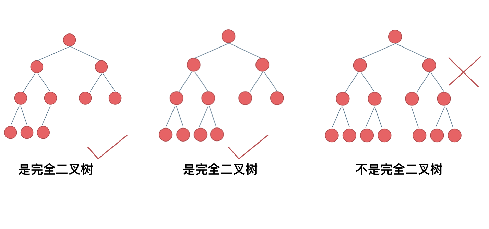

[toc]

# 1.二叉树理论基础
**满二叉树**：如果一棵二叉树只有度为0的结点和度为2的结点，并且度为0的结点在同一层上，则这棵二叉树为满二叉树。

**完全二叉树**：在完全二叉树中，除了最底层节点可能没填满外，其余每层节点数都达到最大值，并且最下面一层的节点都集中在该层最左边的若干位置。若最底层为第 h 层（h从1开始），则该层包含 1~ 2^(h-1) 个节点。


优先级队列其实是一个堆，堆就是一棵完全二叉树，同时保证父子节点的顺序关系。

**二叉搜索树**是一个有序树。
若它的左子树不空，则左子树上所有结点的值均小于它的根结点的值；
若它的右子树不空，则右子树上所有结点的值均大于它的根结点的值；
它的左、右子树也分别为二叉排序树

**平衡二叉搜索树**：又被称为AVL（Adelson-Velsky and Landis）树，且具有以下性质：它是一棵空树或它的左右两个子树的高度差的绝对值不超过1，并且左右两个子树都是一棵平衡二叉树。


C++中map、set、multimap，multiset的底层实现都是平衡二叉搜索树，所以map、set的增删操作时间时间复杂度是logn，注意这里没有说unordered_map、unordered_set，unordered_map、unordered_set底层实现是哈希表。


**二叉树的存储**
那么链式存储方式就用指针， 顺序存储的方式就是用数组。
链式就是常见的TreeNode*
```c++
struct TreeNode{
    int val;
    TreeNode* left;
    TreeNode* right;
    TreeNode():val(0),left(nullptr),right(nullptr){}
    TreeNode(int x):val(x),left(nullptr),right(nullptr){}
    TreeNode(int x, TreeNode *left, TreeNode *right) : val(x),left(left),right(right){}
}

```
数组就是堆中的写法 根结点i 左子叶2*i+1 
右子叶 2*i+2

**二叉树的遍历**
深度优先遍历
前序遍历（递归法，迭代法） -- 根左右
中序遍历（递归法，迭代法） -- 左根右
后序遍历（递归法，迭代法） -- 左右根
广度优先遍历
层次遍历（迭代法） -- bfstree


# 二叉树的三序遍历 -- 递归版本
递归写法:
```c++
//leetcode 144 二叉树前序遍历
/**
 * Definition for a binary tree node.
 * struct TreeNode {
 *     int val;
 *     TreeNode *left;
 *     TreeNode *right;
 *     TreeNode() : val(0), left(nullptr), right(nullptr) {}
 *     TreeNode(int x) : val(x), left(nullptr), right(nullptr) {}
 *     TreeNode(int x, TreeNode *left, TreeNode *right) : val(x), left(left), right(right) {}
 * };
 */
class Solution {
public:
    void preTraversal(TreeNode* root,vector<int>&res){
        if(root == nullptr){
            return;
        }
        res.emplace_back(root->val);
        preTraversal(root->left,res);
        preTraversal(root->right,res);
    }
    vector<int> preorderTraversal(TreeNode* root) {
        vector<int>res;
        preTraversal(root,res);
        return res;
    }
};
//leetcode 145 二叉树后序遍历
class Solution {
public:
    void postTraversal(TreeNode* root,vector<int>&res){
        if(root == nullptr){
            return;
        }
        postTraversal(root->left,res);
        postTraversal(root->right,res);
        res.emplace_back(root->val);

    }
    vector<int> postorderTraversal(TreeNode* root) {
        vector<int>res;
        postTraversal(root,res);
        return res;
    }
};
//leetcode 94 二叉树中序遍历
class Solution {
public:
    void inTraversal(TreeNode* root,vector<int>&res){
        if(root == nullptr){
            return;
        }
        inTraversal(root->left,res);
        res.emplace_back(root->val);
        inTraversal(root->right,res);
    } 
    vector<int> inorderTraversal(TreeNode* root) {
        vector<int>res;
        inTraversal(root,res);
        return res;
    }
};
```
# 二叉树的三序遍历 -- 非递归写法:
这里每一类遍历是不太一样，我们一种一种处理:
前序遍历:
借助一个栈，栈中存放的是根节点，每次将根节点出栈，将right、left依次入栈 -- 注意:由于栈式先入后出，为了满足左右的顺序，这里入栈的顺序就要反过来
```C++
//leetcode 144 二叉树前序遍历
class Solution {
public:
    vector<int> preorderTraversal(TreeNode* root) {
        stack<TreeNode*>table;
        table.push(root);
        vector<int>res;
        while(!table.empty()){
            TreeNode* tmp = table.top();
            table.pop();
            if(tmp == nullptr){continue;}
            res.emplace_back(tmp->val);
            table.push(tmp->right);
            table.push(tmp->left);
        }
        return res;
    }
};
```

对于中序遍历，由于中序是先一直遍历到最左侧子叶，然后向上，这里在入栈的时候，先入左侧子叶，同时还需要一个指针记录当前子叶，用来判断是否到达最底层，到达最底层后(左子叶是nullptr)，将当前栈顶(根节点)读取，这个指针指向节点的右侧节点。
```c++
//leetcode 94 二叉树中序遍历
class Solution {
public:
    vector<int> inorderTraversal(TreeNode* root) {
        stack<TreeNode*>table;
        TreeNode* cur = root;
        vector<int>res;
        //这里是或的关系，因为会存在遍历到根节点而右节点没有入栈的情况，所以推出循环的条件是空栈且右侧没有节点
        while(!table.empty() || cur!=nullptr){
            if(cur!=nullptr){
                table.push(cur);
                cur = cur->left;
            }
            else{
                cur = table.top();
                res.emplace_back(cur->val);
                table.pop();
                cur = cur->right;
            }
        }
        return res;
    }
};
```

后续遍历时左右根，我们只需要在前序根左右的基础上，修改入栈顺序使其变为根右左，然后反转结果即可
```c++
//leetcode 145 二叉树后续遍历
class Solution {
public:
    vector<int> postorderTraversal(TreeNode* root) {
        stack<TreeNode*>table;
        table.push(root);
        vector<int>res;
        while(!table.empty()){
            TreeNode* tmp = table.top();
            table.pop();
            if(tmp == nullptr){continue;}
            res.emplace_back(tmp->val);
            table.push(tmp->left);
            table.push(tmp->right);
        }
        reverse(res.begin(),res.end());
        return res;
    }
};
```

# 二叉树的层序遍历
使用bfs搜索即可:
```c++
//leetcode 102 二叉树的层序遍历
//bfs解法
class Solution {
public:
    vector<vector<int>> levelOrder(TreeNode* root) {
        vector<vector<int>>res;
        queue<TreeNode*>bfsque;
        bfsque.push(root);
        while(!bfsque.empty()){
            int len = bfsque.size();
            vector<int>tmp;
            for(int i=0;i<len;i++){
                TreeNode* topnode = bfsque.front();
                bfsque.pop();
                if(topnode==nullptr){continue;}
                tmp.emplace_back(topnode->val);
                bfsque.push(topnode->left);
                bfsque.push(topnode->right);
            }
            if(tmp.size()>0){
                res.emplace_back(tmp);
            }
        }
        return res;
    }
};
//dfs解法
class Solution {
public:
    void dfs(vector<vector<int>>&res,TreeNode* root,int level){
        if(root==nullptr){return;}
        if(res.size() < level+1){
            res.resize(level+1);
        }
        res[level].emplace_back(root->val);
        dfs(res,root->left,level+1);
        dfs(res,root->right,level+1);
    }
    vector<vector<int>> levelOrder(TreeNode* root) {
        vector<vector<int>>res;
        int cur_level = 0;
        dfs(res,root,cur_level);
        return res;
    }
};

//leetcode 107 二叉树的层序遍历2
//自底向上的层序遍历，在102题的基础上反转结果即可
class Solution {
public:
    vector<vector<int>> levelOrderBottom(TreeNode* root) {
        vector<vector<int>>res;
        queue<TreeNode*>bfsque;
        bfsque.push(root);
        while(!bfsque.empty()){
            int len = bfsque.size();
            vector<int>tmp;
            for(int i=0;i<len;i++){
                TreeNode* topnode = bfsque.front();
                bfsque.pop();
                if(topnode==nullptr){continue;}
                tmp.emplace_back(topnode->val);
                bfsque.push(topnode->left);
                bfsque.push(topnode->right);
            }
            if(tmp.size()>0){
                res.emplace_back(tmp);
            }
        }
        reverse(res.begin(),res.end());
        return res;
    }
};

//leetcode 199 二叉树的右视图
class Solution {
public:
    vector<int> rightSideView(TreeNode* root) {
        vector<int>ans;
        queue<TreeNode*>bfsque;
        bfsque.push(root);
        while(!bfsque.empty()){
            int q_size = bfsque.size();
            for(int i=0;i<q_size;i++){
                auto node = bfsque.front();
                bfsque.pop();
                if(node == nullptr){continue;}
                //为了保证len-1位一定是最右侧的值，这里将非空判断放到push之前，保证每一轮queue中都是有效节点
                if(node->left!=nullptr){bfsque.push(node->left);}
                if(node->right!=nullptr){bfsque.push(node->right);}
                if(i == q_size-1){
                    ans.emplace_back(node->val);
                }
            }
        }
        return ans;
    }
};
//leetcode 637 二叉树的层平均值
class Solution {
public:
    vector<double> averageOfLevels(TreeNode* root) {
        vector<double>ans;
        queue<TreeNode*>bfsque;
        bfsque.push(root);
        while(!bfsque.empty()){
            int len = bfsque.size();
            double sum = 0;
            for(int i=0;i<len;i++){
                auto node = bfsque.front();
                bfsque.pop();
                sum += node->val;
                if(node->left!=nullptr){bfsque.push(node->left);}
                if(node->right!=nullptr){bfsque.push(node->right);}
            }
            ans.emplace_back(sum/len);
        }
        return ans;
    }
};
//leetcode 515 找树的每一行的最大值
class Solution {
public:
    vector<int> largestValues(TreeNode* root) {
        vector<int>res;
        queue<TreeNode*>bfsque;
        if(root == nullptr){return res;}
        bfsque.push(root);
        while(!bfsque.empty()){
            int len = bfsque.size();
            int cur_max = INT_MIN;
            for(int i = 0;i<len;i++){
                TreeNode* topnode = bfsque.front();
                bfsque.pop();
                
                cur_max = max(cur_max,topnode->val);
                if(topnode->left!=nullptr){bfsque.push(topnode->left);}
                if(topnode->right!=nullptr){bfsque.push(topnode->right);} 
            }
            res.emplace_back(cur_max);
        }
        return res;
    }
};
//leetcode 116.填充每个节点的下一个右侧节点指针
class Solution {
public:
    Node* connect(Node* root) {
        Node* head = root;
        if(root==nullptr){return nullptr;}
        queue<Node*>bfsque;
        bfsque.push(head);
        while(!bfsque.empty()){
            int len = bfsque.size();
            Node* phead = nullptr;
            for(int i=0;i<len;i++){
                Node* t_node = bfsque.front();
                bfsque.pop();
                if(phead == nullptr){phead = t_node;}
                else{
                    phead->next = t_node;
                    phead = phead->next;
                }
                if(t_node->left!=nullptr){bfsque.push(t_node->left);}
                if(t_node->right!=nullptr){bfsque.push(t_node->right);}
            }
        }
        return root;
    }
};
//leetcode 104 二叉树的最大深度:
//dfs解法
class Solution {
public:
    int findmaxdep(TreeNode* root){
        if(root == nullptr){
            return 0;
        }
        return 1+max(findmaxdep(root->left),findmaxdep(root->right));
    }


    int maxDepth(TreeNode* root) {
        return findmaxdep(root);
    }
};
//bfs解法
class Solution {
public:
    int maxDepth(TreeNode* root) {
        queue<TreeNode*>bfsque;
        int max_dep = 0;
        if(root == nullptr){return max_dep;}
        bfsque.push(root);
        while(!bfsque.empty()){
            int len = bfsque.size();
            for(int i=0;i<len;i++){
                TreeNode* topNode = bfsque.front();
                bfsque.pop();
                if(topNode->left!=nullptr){bfsque.push(topNode->left);}
                if(topNode->right!=nullptr){bfsque.push(topNode->right);}
            }
            max_dep++;
        }
        return max_dep;
    }
};

//leetcode 111 二叉树最小深度
//dfs解法
class Solution {
public:
    int findminDep(TreeNode* root){
        //由于是查找到一个节点没有子叶才算当前深度，所以如果只有当前侧子树为空，我们应当让其不参与min的运算
        if(root == nullptr){
            return INT_MAX;
        }
        if(root->left==nullptr && root->right==nullptr){
            return 1;
        }
        return 1+min(findminDep(root->left),findminDep(root->right));
    }
    int minDepth(TreeNode* root) {
        if(root == nullptr){return 0;}
        return findminDep(root);
    }
};


//bfs解法 每一层向下查询，查到没有子叶的节点就返回，此时深度一定是最小的
class Solution {
public:
    int minDepth(TreeNode* root) {
        queue<TreeNode*>bfsque;
        int cur_dep = 1;
        if(root == nullptr){return 0;}
        bfsque.push(root);
        while(!bfsque.empty()){
            int len = bfsque.size();
            for(int i=0;i<len;i++){
                TreeNode* topNode = bfsque.front();
                bfsque.pop();
                if(topNode->left!=nullptr){bfsque.push(topNode->left);}
                if(topNode->right!=nullptr){bfsque.push(topNode->right);}
                if(topNode->left == nullptr && topNode->right==nullptr){
                    return cur_dep;
                }
            }
            cur_dep++;
        }
        return cur_dep;
    }
};
```


## 层序遍历 -- N叉树问题

```c++
//leetcode 429 N叉树层序遍历
class Solution {
public:
    vector<vector<int>> levelOrder(Node* root) {
        vector<vector<int>>res;
        queue<Node*>bfsque;
        bfsque.push(root);
        int cnts = 0;
        if(root==nullptr){return res;}
        while(!bfsque.empty()){
            int len = bfsque.size();
            int level = cnts+1;
            res.resize(level);
            for(int i=0;i<len;i++){
                Node* nodetop = bfsque.front();
                bfsque.pop();
                if(nodetop == nullptr){continue;}
                res[cnts].emplace_back(nodetop->val);
                for(Node* nodenext : nodetop->children){
                    bfsque.push(nodenext);
                }
            }
            cnts++;
        }
        return res;   
    }
};
```
N叉树也存在前序、后序遍历下面给出
```c++
//leetcode 589 N叉树的前序遍历
//递归
class Solution {
public:
    void preTra(Node* root,vector<int>&res){
        if(root==nullptr){return;}
        res.emplace_back(root->val);
        for(auto it : root->children){
            preTra(it,res);
        }
    }

    vector<int> preorder(Node* root) {
        vector<int>res;
        preTra(root,res);
        return res;
    }
};
//迭代
class Solution {
public:
    vector<int> preorder(Node* root) {
        vector<int>res;
        stack<Node*>table;
        table.push(root);
        while(!table.empty()){
            Node* t_node = table.top();
            table.pop();
            if(t_node==nullptr){continue;}
            res.emplace_back(t_node->val);
            //注意这里反向迭代器中 ++ 其实在iterator中看就是--
            vector<Node*>::reverse_iterator it = t_node->children.rbegin();
            for(;it!=t_node->children.rend();it++){
                table.push(*it);
            }
        }
        return res;
    }
};
```

这里只给出迭代版本的N叉树后续遍历代码
```C++
class Solution {
public:
    vector<int> postorder(Node* root) {
        vector<int>res;
        stack<Node*>table;
        table.push(root);
        while(!table.empty()){
            Node* t_node = table.top();
            table.pop();
            if(t_node==nullptr){continue;}
            res.emplace_back(t_node->val);
            vector<Node*>::iterator it = t_node->children.begin();
            for(;it!=t_node->children.end();it++){
                table.push(*it);
            }
        }
        reverse(res.begin(),res.end());
        return res;
    }
};
```


实际上N叉树是一个图，说起N叉树不得不提起图论中经典的Tire字典树
```C++
//leetcode 208 实现前缀树 Tire
class Trie {
private:
    bool is_end;
    Trie* NextWord[26];
public:
    Trie() {
        is_end = false;
        for(int i=0;i<26;i++){
            NextWord[i] = nullptr;
        }
    }
    
    void insert(string word) {
        Trie* node = this;
        int len = word.size();
        for(int i=0;i<len;i++){
            if(node->NextWord[word[i] - 'a'] != nullptr){
                node = node->NextWord[word[i]-'a'];
            }
            else{
                node->NextWord[word[i]-'a'] = new Trie();
                node = node->NextWord[word[i]-'a'];
            }
        }
        node->is_end = true;
    }
    
    bool search(string word) {
        Trie* node = this;
        int len = word.size();
        for(int i=0;i<len;i++){
            if(node->NextWord[word[i] - 'a'] != nullptr){
                node = node->NextWord[word[i]-'a'];
            }
            else{
                return false;
            }
        }
        return node->is_end;
    }
    
    bool startsWith(string prefix) {
        Trie* node = this;
        int len = prefix.size();
        for(int i=0;i<len;i++){
            if(node->NextWord[prefix[i] - 'a'] != nullptr){
                node = node->NextWord[prefix[i]-'a'];
            }
            else{
                return false;
            }
        }
        return true;
    }
};
```

# 226 翻转二叉树
递归
```c++
//leetcode 226 翻转二叉树
class Solution {
public:
    TreeNode* invertTree(TreeNode* root) {
        if(root == nullptr){return nullptr;}
        //交换左右子树节点
        TreeNode* tmp = root->left;
        root->left = root->right;
        root->right = tmp;
        //处理左子树
        invertTree(root->left);
        //处理右子树
        invertTree(root->right);
        return root;
    }
};
```
迭代
```c++
class Solution {
public:
    TreeNode* invertTree(TreeNode* root) {
        if(root == nullptr){return nullptr;}
        stack<TreeNode*>table;
        table.push(root);
        while(!table.empty()){
            TreeNode* t_node = table.top();
            table.pop();
            if(t_node == nullptr){continue;}
            TreeNode* tmp = t_node->left;
            t_node->left = t_node->right;
            t_node->right = tmp;
            table.push(t_node->left);
            table.push(t_node->right);
        }
        return root;
    }
};
```
# 101 对称二叉树
```c++
//leetcode 101 对称二叉树
//递归
class Solution {
public:
    bool is_compare(TreeNode* leftTree,TreeNode*rightTree){
        if(leftTree == nullptr && rightTree == nullptr){return true;}
        else if(leftTree == nullptr || rightTree == nullptr){return false;}
        else if(leftTree->val != rightTree->val){return false;}
        else{
            return is_compare(leftTree->right,rightTree->left) && is_compare(leftTree->left,rightTree->right);
        }
    }
    bool isSymmetric(TreeNode* root) {
        if(root == nullptr){return false;}
        return is_compare(root->left,root->right);
    }
};
//迭代
class Solution {
public:
    bool isSymmetric(TreeNode* root) {
        queue<TreeNode*>bfsque;
        if(root == nullptr){return false;}
        bfsque.push(root->left);
        bfsque.push(root->right);
        while(!bfsque.empty()){
            TreeNode* l_node = bfsque.front();
            bfsque.pop();
            TreeNode* r_node = bfsque.front();
            bfsque.pop();

            if(l_node == nullptr && r_node == nullptr){
                continue;
            }
            else if(l_node == nullptr || r_node == nullptr){
                return false;
            }
            else if(l_node->val != r_node->val){
                return false;
            }
            else{
                bfsque.push(l_node->left);
                bfsque.push(r_node->right);
                bfsque.push(l_node->right);
                bfsque.push(r_node->left);
            }
        }
        return true;
    }
};
```
# 222.完全二叉树的节点个数
```C++
//leetcode 222.完全二叉树的节点个数
class Solution {
public:
    int countNodes(TreeNode* root) {
        queue<TreeNode*>bfsque;
        bfsque.push(root);
        int ans = 0;
        while(!bfsque.empty()){
            TreeNode* t_node = bfsque.front();
            bfsque.pop();
            if(t_node == nullptr){continue;}
            ans++;
            bfsque.push(t_node->left);
            bfsque.push(t_node->right);
        }
        return ans;
    }
};
```
# 110.平衡二叉树
```c++
class Solution {
public:
    //返回平衡二叉树的在最大高度，如果判断当前不是平衡二叉树，就返回-1
    int getHeight(TreeNode* root){
        if(root == nullptr){
            return 0;
        }
        int lefthight = getHeight(root->left);
        int righthight = getHeight(root->right);
        if(lefthight == -1 || righthight == -1){return -1;}
        return abs(lefthight - righthight) > 1 ? -1 : 1 + max(lefthight,righthight);
    }
    bool isBalanced(TreeNode* root) {
        return getHeight(root) == -1 ? false : true;
    }
};
```
# 257 二叉树的所有路径
```c++
class Solution {
public:
    void dfs(vector<string>&res,TreeNode* root,string path){
        if(root==nullptr){
            return;
        }
        
        if(root->left==nullptr && root->right==nullptr){
            path += to_string(root->val);
            res.emplace_back(path);
            return;
        }
       
        dfs(res,root->left,path + to_string(root->val) + "->");
        dfs(res,root->right,path + to_string(root->val) + "->");
    }


    vector<string> binaryTreePaths(TreeNode* root) {
        vector<string>res;
        string path = "";
        dfs(res,root,path);
        return res;
    }
};
```
# *** 404 左子叶之和
这个题的关键是需要给出左子叶的判断，
考虑任意一个子树结构
    P
    / \\\
   L  R

只有在p不为空 L不为空 L的两个子结点为空的时候 L就是左子叶   
所以说是否存入一个结点 是需要根据这个结点的父结点来判断的
如果是一个满二叉树 其实可以计算出左子叶在每一层之间的位置 但是就太复杂了
```c++
class Solution {
public:
    int sumOfLeftLeaves(TreeNode* root) {
        int ans = 0;
        stack<TreeNode*>table;
        table.push(root);
        while(!table.empty()){
            TreeNode* cur = table.top();
            table.pop();
            if(cur == nullptr){continue;}
            if(cur->left!=nullptr && cur->left->left==nullptr && cur->left->right==nullptr){
                ans += cur->left->val;
            }
            table.push(cur->left);
            table.push(cur->right);
        }
        return ans;
    }
};
```
# 513. 找到数左下角的值
Given the root of a binary tree, return the leftmost value in the last row of the tree.

查询最后一层的最左侧的元素
```c++
class Solution {
public:
    int findBottomLeftValue(TreeNode* root) {
        queue<TreeNode*>bfsque;
        bfsque.push(root);
        int ans = 0;
        int cur_len = 1;
        int record_len = 0;
        int record_id = 0;
        while(!bfsque.empty()){
            int len = bfsque.size();
            for(int i=0;i<len;i++){
                TreeNode* cur = bfsque.front();
                bfsque.pop();
                if(cur!=nullptr){
                    if(cur_len > record_len && record_id==0){
                        ans = cur->val;
                        record_len = cur_len;
                        record_id = i;
                    }
                }
                if(cur->left!=nullptr){bfsque.push(cur->left);}
                if(cur->right!=nullptr){bfsque.push(cur->right);}
            }
            cur_len++;
        }
        return ans;
    }
};
```

# 112 二叉树的路径之和
标准的回溯
```c++
class Solution {
public:
    bool dfs(TreeNode* root,int curSum){
        if(root == nullptr){
            return false;
        }
       
        curSum -= root->val;
        if(root->left == nullptr && root->right == nullptr){
            return curSum == 0;
        }
        return dfs(root->left,curSum) || dfs(root->right,curSum);
    }
    bool hasPathSum(TreeNode* root, int targetSum) {
        return dfs(root,targetSum);
    }
};
```
相关题目 113 二叉树路径之和2
在上题的基础上 要求返回路径和等于目标值的路线
```c++
class Solution {
public:
    void dfs(TreeNode* root,int curSum,vector<vector<int>>&ans,vector<int>&path){
        if(root==nullptr){return;}
        path.emplace_back(root->val);
        curSum = curSum - root->val;
        if(root->left == nullptr && root->right==nullptr){
            if(curSum == 0){
                ans.emplace_back(path);
            }
        }
        dfs(root->left,curSum,ans,path);
        dfs(root->right,curSum,ans,path);
        path.pop_back();
    }


    vector<vector<int>> pathSum(TreeNode* root, int targetSum) {
        vector<vector<int>>ans;
        vector<int>path;
        dfs(root,targetSum,ans,path);
        return ans;
    }
};
```
# 105/106  过中序和前序遍历构造二叉树/通过中序和后序遍历构造二叉树
105：
给定两个整数数组 preorder 和 inorder ，其中 preorder 是二叉树的先序遍历， inorder 是同一棵树的中序遍历，请构造二叉树并返回其根节点。

1.前序的第一个值一定是根节点
2.确定根节点后在中序遍历的结果找到根节点 在根节点的左侧的都是左子树 右侧的是右子树 由此可以确定左右子树的结点数
3.在前序遍历中 可以分为 根 左 右 当确定结点数后 将数组分为左右两个子树 
4.对两个子树我们采取相同的操作

```c++
class Solution {
private:
    //preorder 和 inorder 均 无重复 元素 前提 可以直接用哈希表查询
    unordered_map<int,int>in_map;
public:
    void create_map(vector<int>&inorder){
        for(int i=0;i<inorder.size();i++){
            in_map[inorder[i]] = i;
        }
    }
    int getid(int val){
        return in_map[val];
    }

    TreeNode* my_buildTree(vector<int>&preorder,vector<int>&inorder,
            int pre_start,int pre_end,int in_start,int in_end){
        if(pre_start > pre_end){return nullptr;}
        if(in_start > in_end){return nullptr;}
        TreeNode * root = new TreeNode(preorder[pre_start]);
        int id = getid(preorder[pre_start]);
        int left_len = id - in_start;
        int right_len = in_end - id;
        root->left = my_buildTree(preorder,inorder,pre_start+1,pre_start+left_len,
                                in_start,id-1);
        root->right = my_buildTree(preorder,inorder,pre_end - right_len + 1,pre_end,
                                id+1,in_end);
        return root;
    }

    TreeNode* buildTree(vector<int>& preorder, vector<int>& inorder) {
        create_map(inorder); 
        return buildTree(preorder,inorder,0,preorder.size()-1,0,inorder.size()-1);
    }
};
```
106：
给定两个整数数组inorder，postorder
其中inorder是二叉树的中序遍历，postorder是同一棵树的后序遍历，构造并返回二叉树。

```c++
class Solution {
private:
    //preorder 和 inorder 均 无重复 元素 前提 可以直接用哈希表查询
    unordered_map<int,int>in_map;
public:
    void create_map(vector<int>&inorder){
        for(int i=0;i<inorder.size();i++){
            in_map[inorder[i]] = i;
        }
    }
    int getid(int val){
        return in_map[val];
    }

    TreeNode* buildTree(vector<int>&inorder,vector<int>&postorder,
            int in_start,int in_end,int pos_start,int pos_end){
        if(pos_start > pos_end){return nullptr;}
        if(in_start > in_end){return nullptr;}
        TreeNode * root = new TreeNode(postorder[pos_end]);
        int id = getid(postorder[pos_end]);
        int left_len = id-in_start;
        int right_len = in_end - id;
        root->left = buildTree(inorder,postorder,
                                in_start,id-1,pos_start,pos_start+left_len-1);
        root->right = buildTree(inorder,postorder,
                                id+1,in_end,pos_end - right_len,pos_end-1);
        return root;
    }

    TreeNode* buildTree(vector<int>& inorder, vector<int>& postorder) {
        create_map(inorder); 
        return buildTree(inorder,postorder,0,inorder.size()-1,0,postorder.size()-1);
    }
};
```

# 654 最大二叉树
```c++
class Solution {
private:
    unordered_map<int,int>hash_table;
public:
    void create_hash(vector<int>& nums){
        for(int i=0;i<nums.size();i++){
            hash_table[nums[i]] = i;
        }
    }

    int find_max(vector<int>&nums,int begin,int end){
        if(begin > end ){return -1;}
        if(begin < 0 || end > nums.size()){return -1;}
        int max_val = nums[begin];
        while(begin <= end){
            int tmp = nums[begin];
            if(tmp > max_val){max_val = tmp;}
            tmp = nums[end];
            if(tmp > max_val){max_val = tmp;}
            begin ++;
            end --;
        }
        return max_val;
    }


    TreeNode* build_tree(vector<int>&nums,int start,int end){
        if(start > end){return nullptr;}
        if(start < 0 || end > nums.size()){return nullptr;}
        int max_val = find_max(nums,start,end);
        
        int id = hash_table[max_val];
        TreeNode * root = new TreeNode(max_val);

        root->left = build_tree(nums,start,id-1);
        root->right = build_tree(nums,id+1,end);
        return root;
    }


    TreeNode* constructMaximumBinaryTree(vector<int>& nums) {
        create_hash(nums);
        return build_tree(nums,0,nums.size()-1);
    }
};
```
# 617 合并二叉树
注意这里对root1、root2为空的判断，只要一方为空，就返回另一方，实际上就是取并集的逻辑
```c++
class Solution {
public:
    TreeNode* mergeTrees(TreeNode* root1, TreeNode* root2) {
        if(root1 == nullptr){return root2;}
        if(root2 == nullptr){return root1;}
        TreeNode* node = new TreeNode(0);
        node->val = root1->val + root2->val;
        node->left = mergeTrees(root1->left,root2->left);
        node->right = mergeTrees(root1->right,root2->right);
        return node;
    }
};
```
# 700 二叉搜索树中搜索
```c++
class Solution {
public:
    TreeNode* searchBST(TreeNode* root, int val) {
        if(root == nullptr){return nullptr;}
        if(root->val > val ){
            return searchBST(root->left,val);
        }
        else if(root->val < val){
            return searchBST(root->right,val);
        }
        else{
            return root;
        }
        return nullptr;

    }
};
```
# 98 验证二叉搜索树
对于二叉搜索树而言，中序遍历一定是递增的，依照这个原则进行判断
```c++
class Solution {
public:
    void in_Traversal(TreeNode* root,vector<int>& in_order){
        TreeNode* cur = root;
        stack<TreeNode*>table;
        while(cur!=nullptr || !table.empty()){
            if(cur!=nullptr){
                table.push(cur);
                cur = cur->left;
            }
            else{
                cur = table.top();
                table.pop();
                in_order.emplace_back(cur->val);
                cur = cur->right;
            }
        }
    }

    bool is_seq(vector<int>&in_order){
        for(int i=1;i<in_order.size();i++){
            if(in_order[i-1] >= in_order[i]){return false;}
        }
        return true;
    }


    bool isValidBST(TreeNode* root) {
        //对于二叉搜索树而言，中序遍历一定是递增的，依照这个原则进行判断
        vector<int>in_order;
        in_Traversal(root,in_order);
        return is_seq(in_order);
    }
};
```

# 530.二叉搜索树的最小绝对差
在上一题的基础上，可以先获取这个搜索树的中序遍历，将问题转换为计算有序数组间任意两个数的差的绝对值的最小值
```c++
class Solution {
public:
   void in_Traversal(TreeNode* root,vector<int>& in_order){
        TreeNode* cur = root;
        stack<TreeNode*>table;
        while(cur!=nullptr || !table.empty()){
            if(cur!=nullptr){
                table.push(cur);
                cur = cur->left;
            }
            else{
                cur = table.top();
                table.pop();
                in_order.emplace_back(cur->val);
                cur = cur->right;
            }
        }
    }
    int getMinimumDifference(TreeNode* root) {
        vector<int>in_order;
        in_Traversal(root,in_order);
        int ans = INT_MAX;
        for(int i=1;i<in_order.size();i++){
            ans = min(ans,in_order[i]-in_order[i-1]);
        }
        return ans;
    }
};
```
# 501.二叉搜索树中的众数
```c++
class Solution {
public:
   void in_Traversal(TreeNode* root,unordered_map<int,int>& in_order){
        TreeNode* cur = root;
        stack<TreeNode*>table;
        while(cur!=nullptr || !table.empty()){
            if(cur!=nullptr){
                table.push(cur);
                cur = cur->left;
            }
            else{
                cur = table.top();
                table.pop();
                in_order[cur->val]++;
                cur = cur->right;
            }
        }
    }
    vector<int> findMode(TreeNode* root) {
        unordered_map<int,int>in_order;
        in_Traversal(root,in_order);
        int max_val = 0;
        int max_times = 0;
        vector<int>ans;
        for(auto [val,times] : in_order){
            if(times > max_times){
                max_times = times;
            }
        }
        for(auto [val,times] : in_order){
            if(times == max_times){
                ans.emplace_back(val);
            }
        }
        return ans;
    }
};
```
# ** 236. 二叉树的最近公共祖先
二叉树自底层向上的遍历
最近的公共祖先一般只有一下三种情况：
1.root的左右两个子叶分别是p、q
2/3.p/q位于root位置，且此时位于root位置的就是公共祖先
4.p、q不是一个root的左右子叶 最近公共祖先和qp相比有多层

此时递归中leftNode表示在当前root的左子树的根结点（root的左子叶）下是否为p/q的祖先
```c++
class Solution {
public:
    TreeNode* lowestCommonAncestor(TreeNode* root, TreeNode* p, TreeNode* q) {
        //情况2/3 当发现根结点是p/q的时候就直接返回了 这里就包含了2/3的情况
        if(root == p || root == q || root == nullptr){return root;}
        TreeNode* leftNode = lowestCommonAncestor(root->left,p,q);
        TreeNode* rightNode = lowestCommonAncestor(root->right,p,q);
        //情况1  如果qp在以root为头的结点的左右两侧
        if(leftNode!=nullptr && rightNode!=nullptr){return root;}
        //情况4  p、q不是一个root的左右子叶 最近公共祖先和qp相比有多层
        if(leftNode!=nullptr && rightNode == nullptr){return leftNode;}
        if(rightNode!=nullptr && leftNode == nullptr){return rightNode;}
        
        return nullptr;
    }
};
```
# 235. 二叉搜索树的最近公共祖先
```c++
class Solution {
public:
    TreeNode* lowestCommonAncestor(TreeNode* root, TreeNode* p, TreeNode* q) {
        if(root == p || root == q || root == nullptr){return root;}
        TreeNode* left = lowestCommonAncestor(root->left,p,q);
        TreeNode* right = lowestCommonAncestor(root->right,p,q);
        if(left!= nullptr && right!=nullptr){return root;}
        if(left != nullptr && right == nullptr){return left;}
        if(left == nullptr && right != nullptr){return right;}
        return nullptr;
    }
};
```

# 701.二叉搜索树中的插入操作
由于不要求平衡 所以按照二叉搜索的方式找到要增加的结点 然后将其存储即可
```c++
class Solution {
public:
    TreeNode* insertIntoBST(TreeNode* root, int val) {
       if(root == nullptr){
           root = new TreeNode(val);
           return root;
       }
        //cur指向增加结点的位置 那么pre就指向添加结点的父结点
        TreeNode* cur = root;
        TreeNode* pre = root;
        while(cur!=nullptr){
            pre = cur;
            if(cur->val < val){cur = cur->right;}
            else{cur = cur->left;}
        }
        TreeNode* add = new TreeNode(val);
        if(pre->val < val){
            pre->right = add;
        }
        else{pre->left = add;}

       return root;
    }
};
```
# **450.删除二叉搜索树中的节点
注意删除的逻辑  -- 画一画图就能理解
```c++
class Solution {
public:
    //删除逻辑 对于搜索树而言 左子树根节点（root->left）一直向右搜索可以找到小于根结点的最大值
    //                      右子树根节点一直向左找可以找打大于根节点的最小值
    //我们查找小于根节点的最大值的结点 将其放到要删除的结点的位置 也就是找结点的前序
    //对于前序结点 我们将其左子叶替换为本身
    //返回删除后cur结点更改后的结果
    TreeNode* deleteOneNode(TreeNode* cur){
        if(cur == nullptr){return nullptr;}
        if(cur->left == nullptr){
            if(cur->right == nullptr){
                return nullptr;
            }
            else{
                return cur->right;
            }
        }
        else{
            //查询cur结点的前序
            TreeNode* replace = cur->left;
            TreeNode* pre = nullptr;
            while(replace->right!=nullptr){
                pre = replace;
                replace=replace->right;
            }
            //此时cur->left 就是需要替换的值
            if(pre == nullptr){
                replace->right = cur->right;
                return replace;
            }
            pre->right = replace->left;
            replace->left = cur->left;
            replace->right = cur->right;
       
            return replace;
        }
    }
    TreeNode* deleteNode(TreeNode* root, int key) {
        //在二叉搜索树中搜索删除结点的位置
        if (root == nullptr) return root;
        TreeNode* cur = root;
        TreeNode* pre = nullptr; // 记录cur的父节点，用来删除cur
        while (cur!=nullptr) {
            if (cur->val == key) break;
            pre = cur;
            if (cur->val > key){cur = cur->left;} 
            else {cur = cur->right;}
        }

        //删除的是根结点
        if(pre == nullptr){
            return deleteOneNode(cur);
        }
        //删除的不是根结点 需要判断cur是pre的哪一个
        if(pre->left == cur){
            pre->left = deleteOneNode(cur);
        }
        else{
            pre->right = deleteOneNode(cur);
        }
        return root;
    }
};

```
# **669. 修剪二叉搜索树
当到达一个结点root的时候 如果此时val小于low root的左侧就可以直接排除 此时需要在右侧子树中查找满足(low,right)的部分 ，大于high同理
而当root满足的时候，就继续向左右遍历即可
```c++
class Solution {
public:
    TreeNode* trimBST(TreeNode* root, int low, int high) {
        if(root == nullptr){return nullptr;}
        if(root->val < low){
            return trimBST(root->right,low,high);
        }
        if(root->val > high){
            return trimBST(root->left,low,high);
        }

        root->left = trimBST(root->left,low,high);
        root->right = trimBST(root->right,low,high);
        return root;
    }
};
```
# 108.将有序数组转换为平衡二叉搜索树
只要每次左右子树的结点数数目相差在1以内，建立的结果一定是平衡的
所以 每次取中位数建树就好了
```c++
class Solution {
public:
    TreeNode* build_tree(vector<int>&nums,int start,int end){
        if(start > end ){return nullptr;}
        int mid = start + (end - start)/2;
        int val = nums[mid];
        TreeNode* root = new TreeNode(val);
        root->left = build_tree(nums,start,mid-1);
        root->right = build_tree(nums,mid+1,end);

        return root; 
    }
    TreeNode* sortedArrayToBST(vector<int>& nums) {
        return build_tree(nums,0,nums.size()-1);
    }
};
```
# 538.把二叉搜索树转换为累加树
反向中序遍历即可
```c++
class Solution {
public:
    TreeNode* convertBST(TreeNode* root) {
        stack<TreeNode*>table;
        TreeNode* cur = root;
        //pre记录中序遍历节点上一个节点的val
        int pre = 0;
        while(cur!=nullptr || !table.empty()){
            if(cur!=nullptr){
                table.push(cur);
                cur = cur->right;
            }
            else{
                cur = table.top();
                table.pop();
                cur->val += pre;
                pre = cur->val; 
                cur = cur->left;
            }
        }
        return root;
    }
};

//递归
class Solution {
private:
    int pre = 0;
public:
    void inTravel(TreeNode* root){
        if(root==nullptr){return;}
        inTravel(root->right);
        root->val += pre;
        pre = root->val;
        inTravel(root->left);
    }
    TreeNode* convertBST(TreeNode* root) {
        TreeNode* ans = root;
        inTravel(ans);
        return root;
    }
};
```
# 152 从后续遍历判断是否是二叉搜索树
方法1 假设后续遍历对应的二叉树是二叉搜索树，就对这个后续遍历排序，此时排序后的数组必定是中序
从中序和后续恢复二叉树后判断这个二叉树是不是搜索树

这里有一个点 如果此时排序后的数组不是中序序列，建树是不会成功的，因为此时通过后序的最后一个元素查中序是不会出现的在传入的范围中的。这里就需要在建树的时候就判断一下
```c++
class Solution {
private:
    unordered_map<int,int>hash;
    bool is_creat = true;
public:
    struct TreeNode{
        int val;
        TreeNode* left;
        TreeNode* right;
        TreeNode():val(0),left(nullptr),right(nullptr){};
        TreeNode(int _val):val(_val),left(nullptr),right(nullptr){};
    };
    TreeNode* create_Tree(const vector<int>&intorder,const vector<int>&postorder,
                int in_start,int in_end,int p_start,int p_end){
        if(in_end < 0 || p_end < 0 ){return nullptr;}
        if(in_start > in_end || p_start > p_end){return nullptr;}
        if(!is_creat){return nullptr;}
        TreeNode* root = new TreeNode(postorder[p_end]);
        int mid_id = hash[postorder[p_end]];
        if(mid_id < in_start || mid_id > in_end){
            is_creat = false;
            return nullptr;
        }
        int left_len = mid_id - in_start;
        int right_len = in_end - mid_id;
        root->left = create_Tree(intorder,postorder,in_start,mid_id-1,
            p_start,p_start+left_len-1);
        root->right = create_Tree(intorder,postorder,mid_id+1,in_end,
            p_end-right_len,p_end-1);
        return root;
    }
    bool is_search(TreeNode* root){
        if(root==nullptr){return false;}
        if(root->left == nullptr && root->right==nullptr){return true;}
        int left_val,right_val;
        if(root->left == nullptr || root->right==nullptr){
            left_val = root->left==nullptr ? INT_MIN : root->left->val;
            right_val = root->right == nullptr ? INT_MAX : root->right->val;
            if(left_val < root->val && right_val > root->val){
                return true;
            }   
        }
        left_val = root->left->val;
        right_val = root->right->val;
        if(left_val < root->val && right_val > root->val){
            return is_search(root->left) && is_search(root->right);
        }               
        return false;
    }

    bool verifyTreeOrder(vector<int>& postorder) {
        if(postorder.size() == 0){return true;}
        vector<int>intorder(postorder.begin(),postorder.end());
        sort(intorder.begin(),intorder.end());
        for(int i=0;i<intorder.size();++i){
            hash[intorder[i]] = i;
        }
        TreeNode* root = create_Tree(intorder,postorder,0,intorder.size()-1,0,postorder.size()-1);
        if(!is_creat){
            return false;
        }
        return is_search(root);
    }
};
```

方法2：从后序的逆序上看，顺序是root right left
将right拆分后如下：
root root1 right1 left1 left
将right2 拆分后如下；
root root1 root2 right2 left2 left1 left

此时存在单调性 root < root1 < roo2 < right2
但是 到left2单调性反转，此时就向上出栈找到left2的父节点父节点

这段算法还需要多画图理解
```c++
class Solution {
public:
    bool verifyTreeOrder(vector<int>& postorder) {
        stack<int>table;
        int len = postorder.size()-1;
        int preRoot = INT_MAX;
        for(int i=len;i>=0;--i){
            if(postorder[i] > preRoot){
                return false;
            }
            while(!table.empty() && postorder[i] < table.top()){
                preRoot = table.top();
                table.pop();
            }
            table.push(postorder[i]);
        }
        return true;
    }
};
```