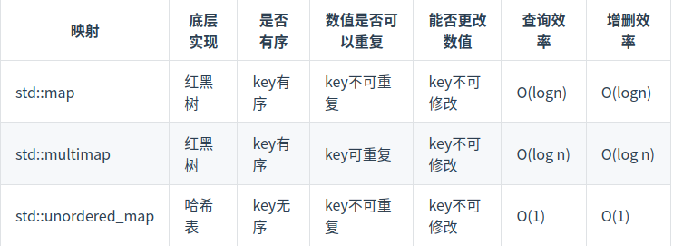
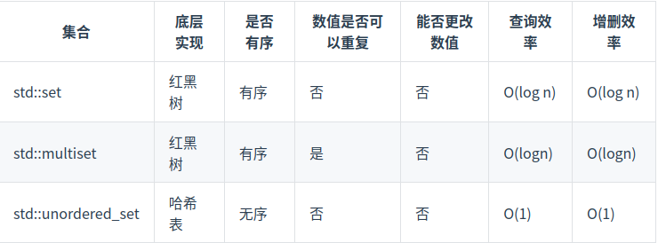

[toc]

# 理论基础
Q:如果出现哈希碰撞怎么办？
A:可以使用方法
1:拉链法，将哈希表该为哈希链表，将冲突的元素按照链表存入。
2:线性探测法，此时一定要保证tablesize大于datasize，当出现冲突的情况，我们会向下探寻哈希表为空的位置来放置冲突数据。

常见的哈希表结构:
数组
set
map

在c++中set和map中提供了下面三种数据结构，底层实现以及优劣如下表所示:


std::unordered_map 底层实现为哈希表，std::map 和std::multimap 的底层实现是红黑树。同理，std::map 和std::multimap 的key也是有序的（这个问题也经常作为面试题，考察对语言容器底层的理解）。

优先使用unordered_set，因为它的查询和增删效率是最优的，如果需要集合是有序的，那么就用set，如果要求不仅有序还要有重复数据的话，那么就用multiset。

当我们遇到了要快速判断一个元素是否出现集合里的时候，就要考虑哈希法

# 242 有效的字母异位词
方案一:对于字母异位词，由于只是字母的乱序排列，可以将字符串重新排序，比较两个重排列的字符是否相等。
```cpp
class Solution {
public:
    bool isAnagram(string s, string t) {
        sort(s.begin(),s.end());
        sort(t.begin(),t.end());
        return strcmp(s.c_str(),t.c_str())==0;
    }
};
```

方案二:使用哈希表
```c++
//使用unordered_map完成
class Solution {
public:
    bool isAnagram(string s, string t) {
        unordered_map<char,int>hash_s;
        unordered_map<char,int>hash_t;
        for(char &c: s ){
            hash_s[c]++;
        }
        int vaild = 0;
        for(char &c :t){
            if(hash_s.find(c)==hash_s.end()){
                return false;
            }
            else{
                hash_t[c] ++;
                if(hash_s[c] == hash_t[c]){
                    vaild++;
                }
                else if(hash_t[c] > hash_s[c]){
                    return false;
                }
            }
        }
        return vaild==hash_s.size();
    }
};
//使用数组完成
class Solution {
public:
    bool isAnagram(string s, string t) {
        int key[26] = {0};
        for(int i=0;i<s.length();i++){
            key[s[i] - 'a'] ++;
        }
        for(int i=0;i<t.length();i++){
            key[t[i] - 'a']--;
            if(key[t[i] - 'a'] < 0){
                return false;
            }
        }
        for(int i=0;i<26;i++){
            if(key[i] > 0){return false;}
        }
        return true;
    }
};


//相关题目:
//leetcode 383 赎金信 -- 不完全使用类型
class Solution {
public:
    bool canConstruct(string ransomNote, string magazine) {
        int key[26] = {0};
        for(int i=0;i<magazine.length();i++){
            key[magazine[i] - 'a'] ++;
        }
        for(int i=0;i<ransomNote.length();i++){
            key[ransomNote[i] - 'a']--;
            if(key[ransomNote[i] - 'a'] < 0){
                return false;
            }
        }
        return true;
    }
};
//leetcode 49 字母异位分组词  -- 异位分组词 排序 然后用哈希表记录即可
class Solution {
public:
    vector<vector<string>> groupAnagrams(vector<string>& strs) {
        vector<vector<string>>res;
        unordered_map<string,int>hash_table;

        for(int i=0;i<strs.size();i++){
            string str_tmp = strs[i];
            sort(str_tmp.begin(),str_tmp.end());
            if(hash_table.find(str_tmp)==hash_table.end()){
                vector<string>tmp(1,strs[i]);
                res.emplace_back(tmp);
                hash_table[str_tmp] = res.size()-1;
            }
            else{
                res[hash_table[str_tmp]].emplace_back(strs[i]);
            }
        }
        return res;
    }
};

//438.找到字符串中所有字母异位词  -- 使用滑动窗口法处理 参考滑动窗口/9字符串滑动窗口.cpp
class Solution {
public:
    vector<int> findAnagrams(string s, string p) {
        unordered_map<char,int>hash_window;
        for(char &c:p){
            hash_window[c]++;
        }

        int left = 0;
        int right = 0;
        int len = s.length();
        vector<int>res;
        unordered_map<char,int>hash_tmp;
        int vaild = 0;


        while(right < len){
            //入窗口
            char tmp = s[right];
            right ++;
            if(hash_window.find(tmp)!=hash_window.end()){
                hash_tmp[tmp]++;
                if(hash_tmp[tmp] == hash_window[tmp]){
                    vaild++;
                }
            }
            //出
            while(right - left > p.length()){
                char tmp = s[left];
                left++;
                if(hash_window.find(tmp)!=hash_window.end()){       
                    if(hash_tmp[tmp] == hash_window[tmp]){
                        
                        vaild--;
                    }
                    hash_tmp[tmp]--;
                }
            }
            if(vaild == hash_window.size()){
                res.emplace_back(left);
            }
        }
        return res;
    }
};


```
# 349 两个数组的交集

```cpp
//leetcode 349 两个数组的交集
class Solution {
public:
    vector<int> intersection(vector<int>& nums1, vector<int>& nums2) {
        unordered_set<int>hash_table;
        for(int i=0;i<nums1.size();i++){
            hash_table.insert(nums1[i]);
        }
        vector<int>res;
        for(int i=0;i<nums2.size();i++){
            if(hash_table.count(nums2[i])!=0){
                res.emplace_back(nums2[i]);
                hash_table.erase(nums2[i]);
            }
        }
        return res;
    }
};
//leetcode 350 两个数组的交集2
//由于需要知道每一个字符在两个数组中的出现次数，所以需要两张表，第二章表建表的时候可以只记录第一张表中出现的字符和当前字符出现次数的最小值
class Solution {
public:
    vector<int> intersect(vector<int>& nums1, vector<int>& nums2) {
        unordered_map<int,int>table1;
        unordered_map<int,int>table2;
        for(int c:nums1){
            table1[c]++;
        }
        for(int c:nums2){
            if(table1.count(c)!=0){
                 table2[c] = min(table1[c],table2[c]+1);
            }
        }
        vector<int>res;
        for(auto &[key,times] : table2){
            for(int i=0;i<times;i++){
                res.emplace_back(key);
            }
        }
        return res;
    }
};
```

# 202快乐数

```cpp
class Solution {
public:
    int getnew(int n){
        int ans = 0;
        while(n > 0){
            //!这里注意 *和%是同一级运算 这里需要加括号
            ans +=  (n % 10) * (n % 10);
            n = n/10;
        }
        return ans;
    }
    bool isHappy(int n) {
        unordered_set<int>hash;
        while(n!=1){
            n = getnew(n);
            if(hash.count(n)==0){hash.insert(n);}
            else{break;}
        }
        return n==1;
    }
};

```

# 1.两数之和
```cpp
//leetcode 1 两数之和
class Solution {
public:
    vector<int> twoSum(vector<int>& nums, int target) {
        vector<int>res(2,-1);
        unordered_map<int,int>hash;
        for(int i=0;i<nums.size();i++){
            if(hash.find(target -  nums[i]) != hash.end()){
                res[0] = hash[target -  nums[i]];
                res[1] = i;
                return res;
            }
            hash[nums[i]] = i;
        }
        return res;
    }
};
```
# 454 四数相加2

思路 建立哈希表 一张记录前两个数组的数字和，一张记录后两个数组的数字和，然后检查是否有为0的
```c++
//leetcode  454 四数相加2
class Solution {
public:
    void inithashmap(vector<int>& nums1, vector<int>& nums2, unordered_map<int,int>&ans2times){
        for(int i=0;i<nums1.size();i++){
            for(int j=0;j<nums2.size();j++){
                ans2times[nums1[i] + nums2[j]]++;
            }
        }
    }

    int fourSumCount(vector<int>& nums1, vector<int>& nums2, vector<int>& nums3, vector<int>& nums4) {
        int res = 0;
        unordered_map<int,int>ans2times12;
        unordered_map<int,int>ans2times34;

        inithashmap(nums1,nums2,ans2times12);
        inithashmap(nums3,nums4,ans2times34);

        for(auto &[ans1,times1] : ans2times12){
            for(auto &[ans2,times2] :ans2times34){
                if(ans1 + ans2 == 0){
                    res += times1 * times2;
                }
            }
        }
        return res;
    }
};

//改进版本: 在建第二张表的时候就执行判断
class Solution {
public:
    void inithashmap(vector<int>& nums1, vector<int>& nums2, unordered_map<int,int>&ans2times){
        for(int i=0;i<nums1.size();i++){
            for(int j=0;j<nums2.size();j++){
                ans2times[nums1[i] + nums2[j]]++;
            }
        }
    }
    int fourSumCount(vector<int>& nums1, vector<int>& nums2, vector<int>& nums3, vector<int>& nums4) {
        int res = 0;
        unordered_map<int,int>ans2times12;
        inithashmap(nums1,nums2,ans2times12);
        for(int i=0;i<nums3.size();i++){
            for(int j=0;j<nums4.size();j++){
                if(ans2times12.find(-nums3[i] - nums4[j])  != ans2times12.end()){
                    res += ans2times12[-nums3[i] - nums4[j]];
                }
            }
        }
        return res;
    }
};
```
# 15 三数之和  -- 双指针法处理
这道题目的关键是如何去重，这里我们分析一下去重逻辑:
1.当外层遍历到nums[i]的时候，检查上一个遍历的元素nums[i-1]，如果相同就跳过
2.当内层二分法找到元素时，这时不能跳出二分法，需要将左和右缩小到下一个不等于当前值的元素
```cpp
class Solution {
public:
    vector<vector<int>> threeSum(vector<int>& nums) {
        vector<vector<int>>res;
        sort(nums.begin(),nums.end());
        for(int i=0;i<nums.size()-2;i++){
            if(i>0 && nums[i] == nums[i-1]){continue;}
            int left = i+1;
            int right = nums.size()-1;
            //由于明确三个数下标不能相等，所以这里不取等号
            while(left < right){
                int target = nums[left] + nums[right];
                if(target + nums[i] > 0 ){
                    right --;
                }
                else if(target + nums[i] < 0){
                    left++;
                }
                else{
                    vector<int>tmp = {nums[i],nums[left],nums[right]};
                    res.emplace_back(tmp);
                    int cur = nums[left]; 
                    while(left < right && nums[left] == cur){
                        left++;
                    }
                    cur = nums[right];
                    while(left < right && nums[right] == cur){
                        right--;
                    }
                }
            }
        }
        return res;
    }
};
```
# 18 四数之和


方案 1 在三数之和的基础上 外面多嵌套一层循环做四数之和
```c++
class Solution {
public:
         void threeSum(vector<int>nums,int start ,long long target,vector<vector<int>>&res,int id){
        for(int i=start;i<nums.size()-2;i++){
            if(i>start && nums[i] == nums[i-1]){continue;}
            if(nums[i]>0 && nums[i]>target){break;}
            int left = i+1;
            int right = nums.size()-1;
            
            //由于明确三个数下标不能相等，所以这里不取等号
            while(left < right){
                long long idx = (long long)nums[i]+ (long long)nums[left] +  (long long)nums[right];   
                if(idx > target ){
                    right --;
                }
                else if(idx < target){
                    left++;
                }
                else{
                    vector<int>tmp = {id,nums[i],nums[left],nums[right]};
                    res.emplace_back(tmp);
                    int cur = nums[left]; 
                    while(left < right && nums[left] == cur){
                        left++;
                    }
                    cur = nums[right];
                    while(left < right && nums[right] == cur){
                        right--;
                    }
                }
            }
        }
    }

    vector<vector<int>> fourSum(vector<int>& nums, int target) {
        sort(nums.begin(),nums.end());
        int len = nums.size();
        vector<vector<int>>res;
        if(len < 4){return res;}
        for(int i=0;i<len-3;i++){
            if(i>0 && nums[i] == nums[i-1]){continue;}
            if(nums[i] > 0 && nums[i] > target){break;}
            long long cur_target = target-nums[i];
            threeSum(nums,i+1,cur_target,res,nums[i]);
        }
        return res;
    }
};
```


# 128. 最长连续序列  -- 检查num-1的去重
```c++
class Solution {
public:
    int longestConsecutive(vector<int>& nums) {
        unordered_set<int>maps;
        int len = nums.size();
        for(int i=0;i<len;++i){
            if(maps.find(nums[i])!=maps.end()){continue;}
            maps.insert(nums[i]);
        }
        int max_len = 0;
        int cur_len = 0;
        for(auto id : maps){
            //题目的关键在于如何去重  
            /*
            如果不去重 相当于对哈希表中每一个元素都进行一次遍历查询 这显然不合适
            所以我们进行去重 检查这个元素的上位如果存在于表中，就跳过 因为这不是起点
            */
            if(maps.find(id-1)!=maps.end()){
                continue;
            }
            cur_len = 1;
            while(maps.find(++id)!=maps.end()){
                ++cur_len;
            }
            max_len = max(max_len,cur_len);
            cur_len = 0;
        }
        return max_len;
    }
};
```

# *** 41. 缺失的第一个正数
题目明确要求 时间复杂度是O(n),空间复杂度O(1)

如果直接创建哈希表将违背空间复杂度要求
如果使用排序将违背时间复杂度要求(堆排序也是nlogn)

此时需要 **将数组视为哈希表**

在这个题中就是对于nums[i] 我们希望他出现在nums[nums[i]-1]的位置上。例如2 我们希望出现在 下标为1的位置上

这里需要注意交换的终止：
交换完毕后有两种情况:
1.将负数、0交换到nums[i]上，此时不在交换
2.将另一个正数交换到nums[i]上，此时需要判断nums[i]能不能满足 nums[i] == nums[nums[i]-1] 如果不满足就继续查找 -- 所以这里需要一个循环

```c++
class Solution {
public:
    int firstMissingPositive(vector<int>& nums) {
        int len = nums.size();
        for(int i=0;i<len;++i){
            while(nums[i] > 0 && nums[i] <= len && nums[nums[i]-1]!=nums[i]){
                swap(nums[i],nums[nums[i]-1]);
            }
        }
        for(int i=0;i<len;++i){
            if(nums[i]!=i+1){
                return i+1;
            }
        }
        return nums.size()+1;
    }
};
```
# *** 391. 完美矩形 -- 如何自定义哈希
注意这里调用构造的写法:
hash<T1>{}(value)

使用hash<T1>{}构造一个hash函数对象
因为正常调用hash函数获取值是这样的:
```c++
// 创建一个 std::hash<int> 对象
std::hash<int> hash_fn;
// 调用对象来计算哈希值
size_t hash_value = hash_fn(value);
//这里其实就是hash<T1>{}等价于std::hash<int> hash_fn;
```

```c++
class Solution {
public:
    //矩形之间不能有重叠 不能有空缺
    //1. 大矩形内部的点 只用用2次或4次 大矩形边缘的点只能用一次
    //2. 所有小矩形的面积之和等于大矩形面积
    struct hash_pair{
        template<class T1,class T2>
        size_t operator()(const pair<T1,T2>& p)const{
            auto hash1 = hash<T1>{}(p.first);
            auto hash2 = hash<T2>{}(p.second);
            return hash1^hash2;
        }
    };
    long get_area(const vector<int>&rectangle){
        if(rectangle[0] > rectangle[2] || rectangle[1] > rectangle[3]){return -1;}
        return(static_cast<long>(rectangle[2]-rectangle[0]) * static_cast<long>(rectangle[3]-rectangle[1]));
    }
    bool isRectangleCover(vector<vector<int>>& rectangles) {
        unordered_map<pair<int,int>,int,hash_pair>pnts_cnts;
        int min_x = rectangles[0][0];
        int min_y = rectangles[0][1];
        int max_x = rectangles[0][2];
        int max_y = rectangles[0][3];
        long area = get_area(rectangles[0]);
        pnts_cnts[make_pair(rectangles[0][0],rectangles[0][1])] +=1;
        pnts_cnts[make_pair(rectangles[0][2],rectangles[0][1])] +=1;
        pnts_cnts[make_pair(rectangles[0][2],rectangles[0][3])] +=1;
        pnts_cnts[make_pair(rectangles[0][0],rectangles[0][3])] +=1;

        for(int i=1;i<rectangles.size();++i){
            min_x = min(min_x,rectangles[i][0]);
            min_y = min(min_y,rectangles[i][1]);
            max_x = max(max_x,rectangles[i][2]);
            max_y = max(max_y,rectangles[i][3]);
            area += get_area(rectangles[i]);
            pnts_cnts[make_pair(rectangles[i][0],rectangles[i][1])] +=1;
            pnts_cnts[make_pair(rectangles[i][2],rectangles[i][1])] +=1;
            pnts_cnts[make_pair(rectangles[i][2],rectangles[i][3])] +=1;
            pnts_cnts[make_pair(rectangles[i][0],rectangles[i][3])] +=1;
        }

        long sum_are = get_area({min_x,min_y,max_x,max_y});
        if(sum_are!=area){return false;}

        pair<int,int>p1 = {min_x,min_y};
        if(pnts_cnts[p1]!=1){return false;}
        pnts_cnts.erase(p1);
        p1 = {max_x,min_y};
        if(pnts_cnts[p1]!=1){return false;}
        pnts_cnts.erase(p1);
        p1 = {max_x,max_y};
        if(pnts_cnts[p1]!=1){return false;}
        pnts_cnts.erase(p1);
        p1 = {min_x,max_y};
        if(pnts_cnts[p1]!=1){return false;}
        pnts_cnts.erase(p1);

        for(auto&[pts,cnts] : pnts_cnts){
            if(cnts!=2 && cnts!=4){return false;}
        }
        return true;
    }
};
```