图形结构：
图的逻辑结构 多对多
没有顺序存储结构 二维数组来表示（邻接矩阵）

### 图的遍历：

**在访问的时候，设定一个长度为图结点数量的数组，用来记录当前结点是否被访问**

**深度优先DFS**
从图的某一个顶点出发，访问他的任一临接顶点 如果当前顶点被访问过，就退回上一个结点，直到所有的结点都被访问过。
访问的次序不一样 访问的次序也不一样，类似于树的遍历
如果用邻接矩阵扫描 都要从头扫描这个顶点所在的行 时间复杂度为n^2
如果使用邻接表扫描 只需要访问e个结点就可以 时间复杂度为n+e
    

**广度优先BFS**
从图的某一个顶点出发，一次访问这些图的邻接点，然后从这些邻接点在进行访问。类似于按层查找。

使用队列实现： 不断将结点入队

如果用邻接矩阵扫描 都要从头扫描这个顶点所在的行 时间复杂度为n^2
如果使用邻接表扫描 只需要访问e个结点就可以 时间复杂度为n+e

### 最小生成树
生成树 ： 所有顶点均由边连接到一起，但不存在回路的图
生成树的图是极小连通子图 去掉一条边就非连通，如果在增加一条边，就会产生回路
n个结点要有n-1个边

#### 无向图的生成树
可以通过BFS或DFS构造生成树（即找到已经找到过的结点，就结束（而不是回退））

#### 最小生成树的定义
在带有权值的无向网中，这个网的所有生成树中，使得各边权值之和最小，就叫做最小生成树
常见应用：n给城市铺n-1条路 保证n个城市连通，并且花费最小。

#### 构造最小生成树
构造最小生成树的算法都使用MST性质：有一个无向网，若边uv是一条具有最小权值的边，其中u属于U，v属于V，U、V互为差集合(U+V=I),那么一定存在一个生成树包含uv

**1.Prim算法**
设N=（V,E）是连通网，TE是N上最小生成树中边的结合
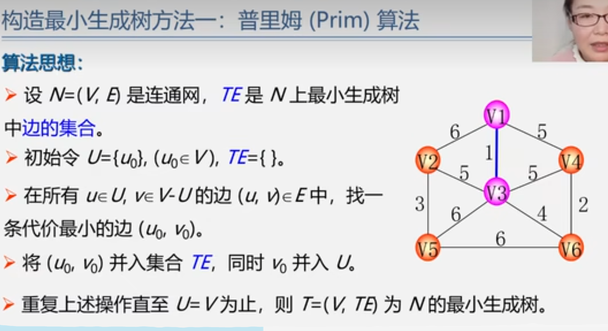

在上图中：
1.U中去V1 V中去V2-V6 在U和V之中连接的边，找权重最小的边V1-V3 将其加入到T中
2.此时U1中加入V3 直到U中包含所有顶点 T就是最小生成树的集合
时间复杂度n^2

适用于稠密图 

**Kruskal算法**
对于所有的边进行一个排序，选取最小权重的边(加入边不能形成环)，直到所有顶点都连通/一共生成了n-1条边
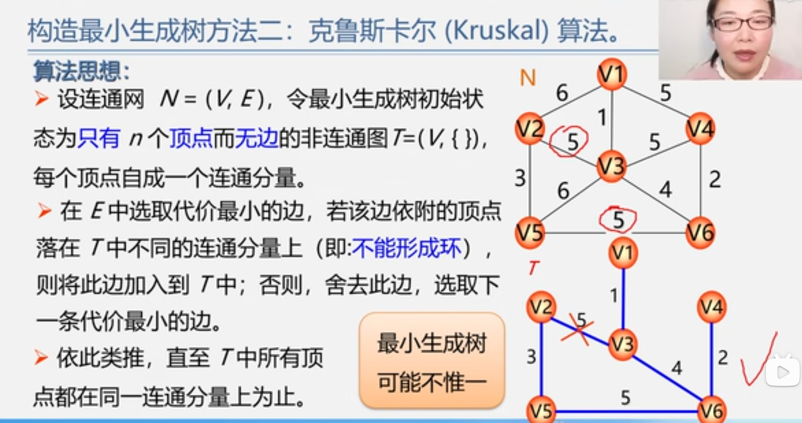
在上图中 如果V5V6结点中的边的权重是5 就会得到两个不同的最小生成树，所以最小生成树是科能不唯一的。
时间复杂度eloge e为边数
使用于稀疏图 -- 边数少

#### 图的应用 -- 最短路径
问题一：单源最短路径问题
使用有向网来表示：从一个地点（顶点）到一个地点（顶点）的多条路径中，寻找各边权值之和最小的路径，也就是最短路径。（相比最小生成树，并不需要遍历全部顶点）

Dijkstra算法
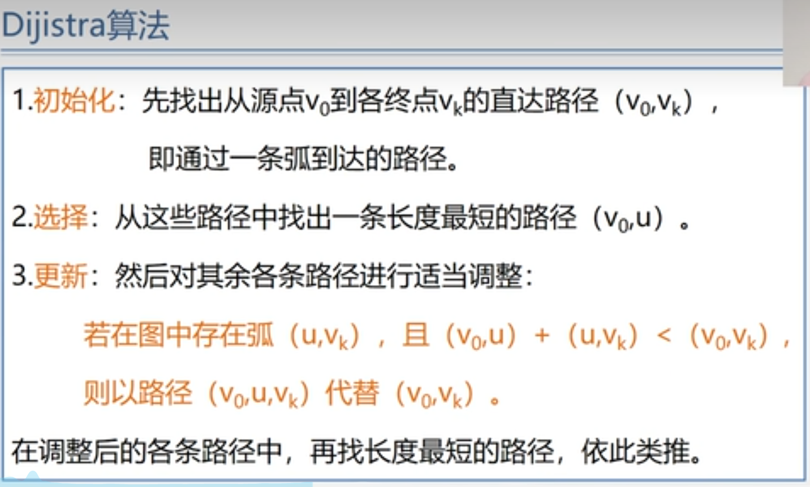
按照路径长度递增次序产生最短路径
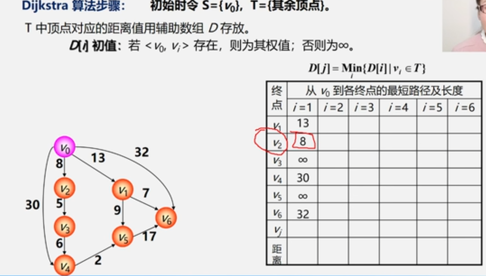
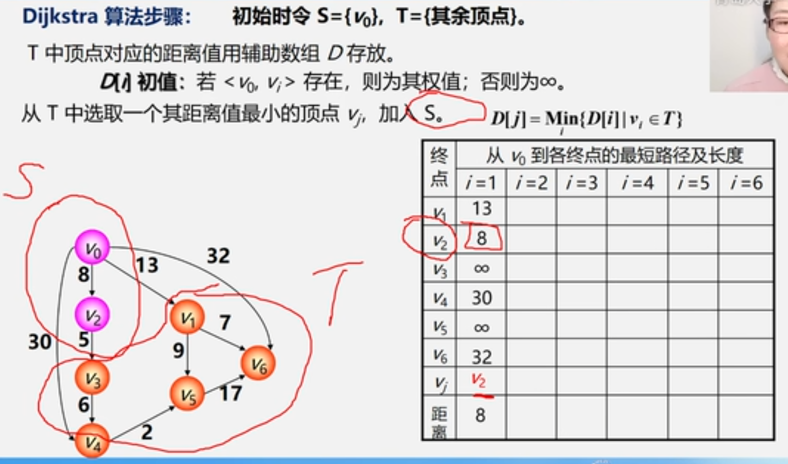
第一轮查询后，将V2加入S中去，接下来找S到T的最短距离，之后继续找距离最短的顶点，将其加入S中，直到S等于V为止
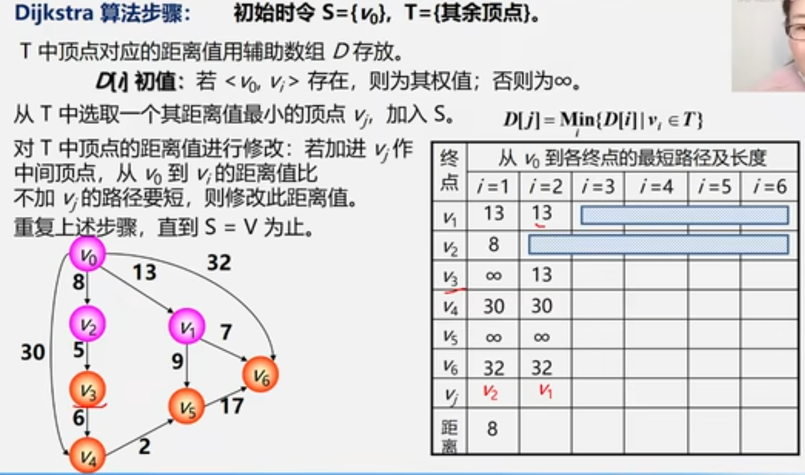
如此时V1加入S 则V0到V1的最短路径长度为13
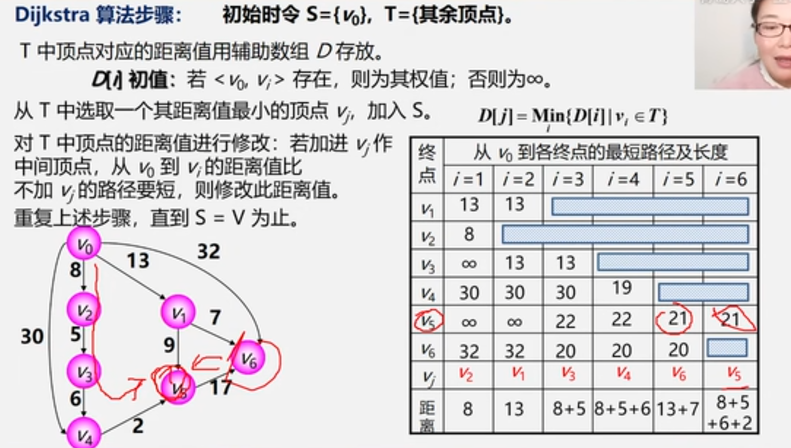

问题二：所有顶点间到其他各点的最短路径
方法1 重复执行n此Dijkstra算法o(N^3)
方法2 Floyd算法o(N^3)
算法思想：
逐个顶点试探，从Vi到Vj的所有可能存在的路径中寻出一条长度最短的路径
使用n阶方阵 令对角线元素为0 若存在直达的弧<vi,vj>,就将(i,j)设置为权值，否则设置为无穷大

如图
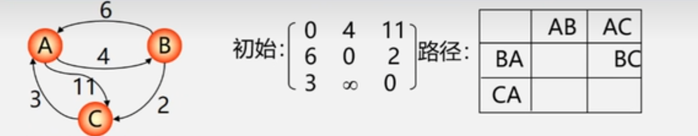

逐步在原直接路径中增加中间顶点，若加中间顶点后路径变短，就修改，直到所有顶点测试完毕，算法结束。
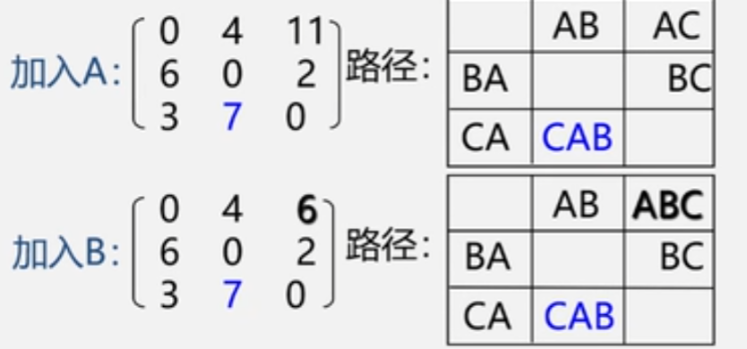

#### 图的应用 -- 拓扑排序
有向无环图 ： 无环的有向图 简称DAG图
场景 ：一个大工程可以分为几个小的流程 小流程之间存在相互制约关系，当小流程全部完成后大工程才会完成
AOV网 -- 拓扑排序问题
一个有向图表示一个工程的各个子工程之间的相互制约的关系，其中顶点表示活动，弧表示活动之间的优先制约关系，这种有向图为顶点表示活动的网

案例 ： 排课程表  -- T53 leetcode207
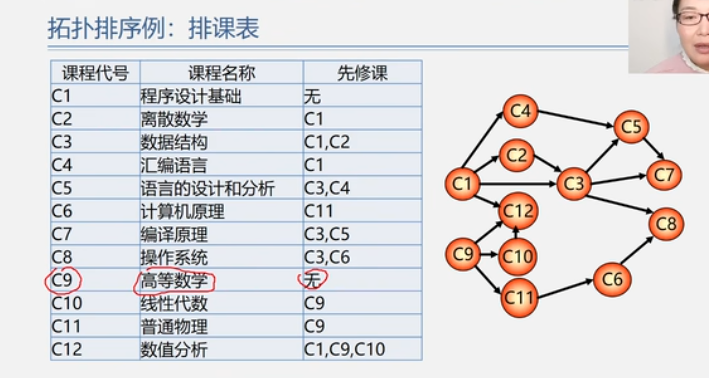

若i到j有一条有向路径，i是j的前驱 j是i的后继
AOV网中不允许有回路 否则进入死锁关系。

拓扑排序 -- leetcode 课程表：
在AOV网中我们将全部活动排列成一个线性序列，若AOV网中有弧ij存在 i一定在j前面，具有线性有序的特征，这个过程是拓扑排序。

排序方法：
在有向图中选取一个没有前驱的顶点并输出，从图中删除这个顶点和所有以它为尾的弧。
重复上述操作明知道所有顶点全部已经输出为之

在上图的例子中
先选取C1 将C1所有的弧删除，之后选取C2(默认：选取编号小的，选取方式不同，就回存在不同的拓扑排序)……直到所有的顶点全部选取完毕。

#### 图的应用 -- 关键路径

AOE网 -- 关键路径问题
一个有向图表示一个工程的各个子工程之间的相互制约的关系，其中弧表示活动，顶点表示活动的开始或结束事件，这种有向图为边表示活动的网

案例：
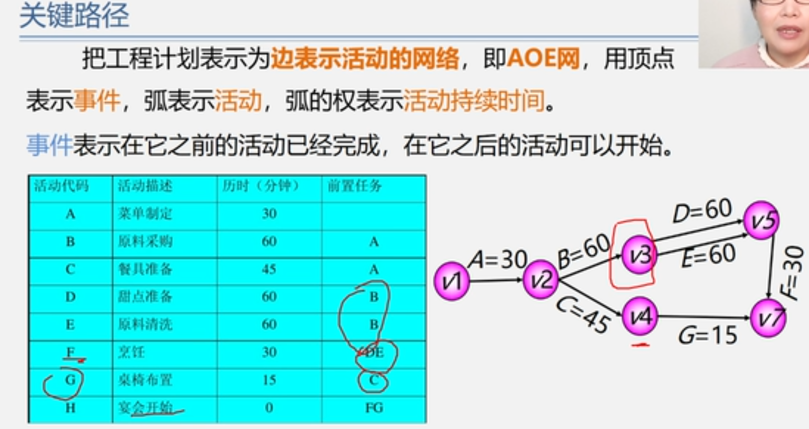

在上述案例中，将工程计划表示为用边表示活动的网络，用顶点表示事件、弧表示活动，弧的权表示活动持续事件，时间表示在它之前活动已经完成，也可以表示之后的活动可以开始。

在AOE网中 入度为0的点叫做源点 出度为0的点叫做汇点

关键路径 ： 路径长度最长的路径
路径长度 ： 路径上各个活动持续时间之和

定义4个描述量：
ve(vj) 事件vj最早发生的时间  ve(v1) = 0 ve(v2)=30
vl(vj) 事件vj最晚发生的时间  vl(v7) = 180(最长准备时间3h) - 15  = 165
e(A)  活动A最早开始时间
l(A)  活动A最晚开始时间
l(A) - e(A)  表示完成活动A的时间余量 如果这个值为0 称为关键活动，有关键活动构成的路径称为关键路径

例如 j --ai-- k   记j-k的持续时间为Wjk
e(i) = ve(j)
l(i) = vl(k) - wjk
ve(1) = 0 开始 向前递推
ve(j) = Max{ve(i) + wij}
vl(n) = ve(n)开始向后递推
vl(i) = Min(vl(j) - wij)

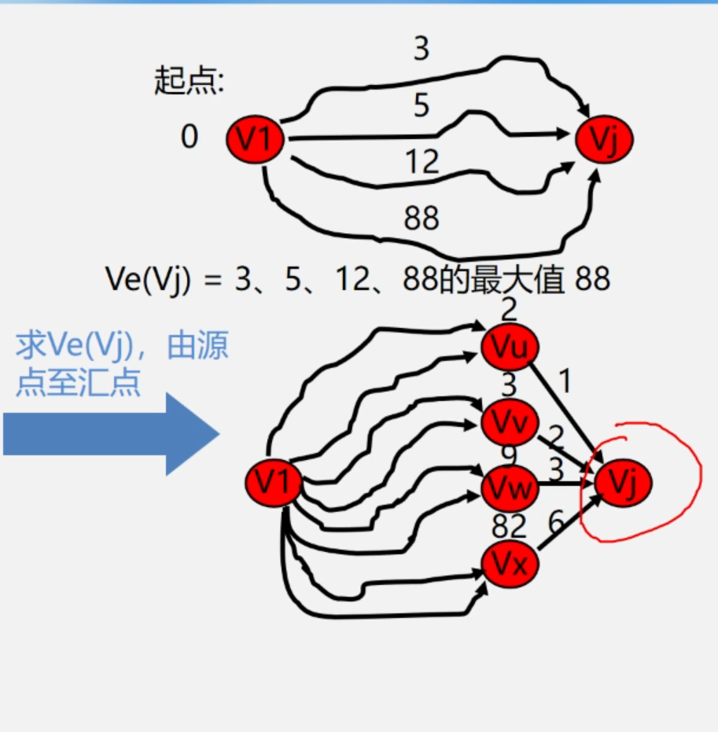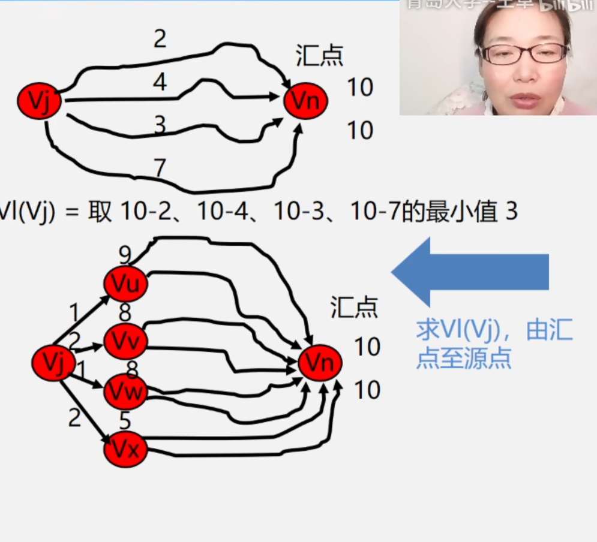

计算步骤：
1.求ve(i),vl(j)
2.求e(i),l(i)
3.计算l(i)-e(i)