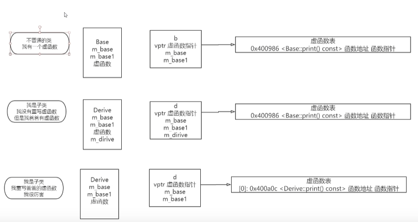

# 类的实例化对象的分布
在类中有成员变量和成员函数。但是在类的实例化对象中的内存分布中，只有成员变量而没有函数

例如
```c++
class m_test{
public:
    int a;
    int b;
    void func(){
        ...
    }
}
m_test A;

//A的内存中只有 a、b的数据，并且按照定义的顺序来排列
```
而对于类的成员函数时通过对象引用或指针实现的，编译器生成的代码直到如何在代码段中找到响应的函数，而成员函数则是存储在代码段中。

对于类的静态成员函数本身就不和实例对象相关，所以对象内存中不含有静态成员函数。

对于虚函数情况就复杂一些，含有虚函数的类在实例化对象的时候会为对象在内存中存储一个虚函数指针指向虚函数表表头


# 虚函数指针和虚函数表

## 1、虚函数的含义
只有用virtual声明类的成员函数，称之为虚函数。

## 2、虚函数的作用
实现多态的基础

## 3、虚函数的实现关键
### 虚函数指针在哪里 是干什么的
虚函数指针 指向虚函数表的地址，存放在每一个基类对象的内存中，在构造函数构造对象时，设置虚表指针vfptr

虚函数表 其本身就是一个地址数组，在编译阶段生成，编译器将类中虚函数的地址存放在虚函数表中，虚函数表存在于全局数据区.data，每个类仅有一个，供所有对象共享。
(在gdb中使用vtbl查看对象的虚函数表: info vtbl xx)

如果类中存有虚函数的时候，创建类的对象的时候，此时就会为类创建


而在进程关系中有下面情况:
子类继承了父类 没有重写
由于没有重写 此时子类的虚函数表中还是父类的虚函数(子类的虚函数表和父类的虚函数表并不是一个！但是虚函数表中虚函数表中函数的地址和父类中一样)


子类继承了父类 执行了重写
此时子类的虚函数表中的虚函数指针并不会和父类中的虚函数相同



上述可以通过一个实验证明:
例如在code中我们写了四个类
```c++
#include <iostream>

using namespace std;

//没有虚函数的基类base_class_no_virtual
class base_class_no_virtual{
public:
        int val;
        char ch;
	void func(){
	}
};
//有虚函数的基类base_class
class base_class{
public:
        int val;
        char ch;
        virtual void show(){
            std::cout << " base class" << std::endl;
        }
};

//继承有虚函数的基类base_class的子类son_1 但不重写虚函数
class son_1_class:public base_class{
public:
        int val;
        char ch;    
};
//继承有虚函数的基类base_class的子类son_2 重写虚函数
class son_2_class:public base_class{
public:
        int val;
        char ch;
        virtual void show()override {
            std::cout << " son class" << std::endl;
        }
};

int main(){
    base_class_no_virtual bcnv;
    base_class bc;
    son_1_class s1;
    son_2_class s2;
    return 0;
}
```
使用gdb调试
```c++

p bcnv
$1 = {val = 1433754896, ch = 85 'U'}
(gdb) info vtbl bcnv
This object does not have a virtual function table

(gdb) p bc
$2 = {_vptr.base_class = 0x555555755d40 <vtable for base_class+16>, 
  val = 1431653324, ch = 85 'U'}
(gdb) info vtbl bc
vtable for 'base_class' @ 0x555555755d40 (subobject @ 0x7fffffffda70):
[0]: 0x555555554bce <base_class::show()>

// 上述可以看出，只有有虚函数的class的实例化对象会有一个虚指针 指向虚表地址

(gdb) p s1
$3 = {<base_class> = {
    _vptr.base_class = 0x555555755d28 <vtable for son_1_class+16>, 
    val = 1431653629, ch = 85 'U'}, val = -136430784, ch = -1 '\377'}
(gdb) info vtbl s1
vtable for 'son_1_class' @ 0x555555755d28 (subobject @ 0x7fffffffda80):
[0]: 0x555555554bce <base_class::show()>
(gdb) p s2
$4 = {<base_class> = {
    _vptr.base_class = 0x555555755d10 <vtable for son_2_class+16>, 
    val = 1431652880, ch = 85 'U'}, val = -9312, ch = -1 '\377'}
(gdb) info vtbl s2
vtable for 'son_2_class' @ 0x555555755d10 (subobject @ 0x7fffffffdaa0):
[0]: 0x555555554c06 <son_2_class::show()>

//上述看出 虽然子类的虚指针(虚表存放地址)不一样，说明一个class就会有一个区域存储虚表
//不重写的函数 虚表中存储的虚函数指针(s1)是和父类一致的0x555555554bce。而重写的则不一致(s2 0x555555554c06)
```

## 4. 一个空类的实例化对象的大小是怎么样的
如果类中没有虚函数，此时实例化结果的大小是根据编译器而定的，如在vs中大小是1

而如果含有虚函数，此时对象中会多一个虚函数指针，例如下面代码中mc大小为4
```c++
class MyClass
{
public:
    MyClass();
    ~MyClass();
    virtual void test() {
        std::cout << "AAA" << std::endl;
    };
private:
};
MyClass::MyClass()
{
}
MyClass::~MyClass()
{
}
int main(){
    MyClass mc;
    std::cout << sizeof(mc) << std::endl;   // 4
}
```


在一个含有虚函数的父类，其子类继承了父类的之后，其虚函数表中存储的函数指针数量为:
1. 子类中重写的父类的虚函数
2. 子类中自己定义的虚函数
3. 如果子类中没有重写，那么子类中会复制父类的虚函数地址

注意:重写并不会导致虚函数表中的指针数量增加
