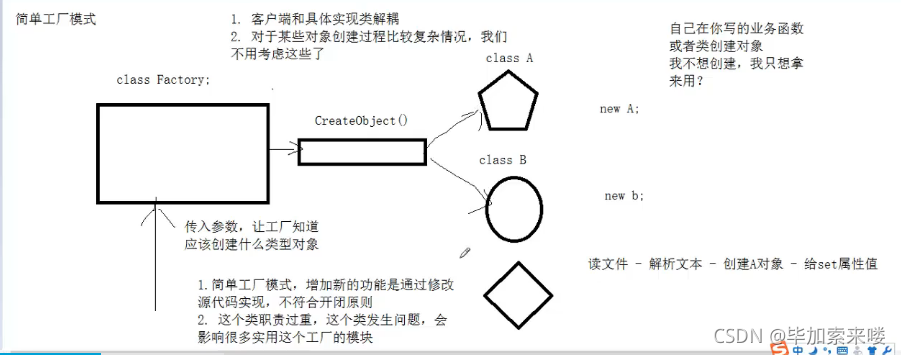

[toc]

# 设计原则
## ***开闭原则
对修改关闭，对扩展开放
对新增的功能是通过新增代码实现的，而不是修改源代码实现的

## 迪米特原则(最少知道原则)
一个对象应当对其他对象尽可能少的了解，从而降低各个对象之间的耦合，提高系统的可维护性。 -- 尽可能的解耦合，知道的越多，耦合性越强，程序越不好维护

## 合成复用原则
继承和组合优先使用组合  在一些场景 例如继承的对象中需要重写同一个函数用于不同的场合，此时组合就优先于继承。注意这里并不是说只用组合。例如下面的场景：
```c++
//抽象车
class AbstractCar {
public:
	virtual void run() = 0;

};

//大众车
class Dazhong :public AbstractCar {
public:
	virtual void run() {
		cout << "大众车启动" << endl;
	}
};

//拖拉机
class Tuolaji :public AbstractCar {
public:
	virtual void run() {
		cout << "拖拉机启动" << endl;
	}
};
//笨方法，针对具体类 不适用继承
#if 0
class Person :public Tuolaji {
public:
	void Dongfeng() {
		run();
	}
};
class Person2 :public Dazhong {
public:
	void Dazhong() {
		run();
	}
};
#endif
//可以使用合成复用原则
class Person {
public:
	void setCar(AbstractCar* car) {
		this->car = car;
	}
	void Dongfeng() {
		this->car->run();
		if (this->car != NULL) {
			delete this->car;
			this->car = NULL;
		}
	}
public:
	AbstractCar* car;
};
void test02() {
	Person* p = new Person;
	p->setCar(new Dazhong);
	p->Dongfeng();
	p->setCar(new Tuolaji);
	p->Dongfeng();

	delete p;
}
```
此时仍然是进行多态 但是并不是使用继承

## 依赖倒转原则
**依赖于抽象(接口)，不要依赖具体的实现(类)，也就是针对接口编程。**
高级业务逻辑依赖于抽象层的调用，实现层依赖于抽象层的实现
，仍然是上面的代码，对于客户层通过调用抽象层car决定setcar和run的实际对象；对于底层tuolaji、dazhong也是依赖于car的抽象层

## 参考链接
https://blog.csdn.net/weixin_42636062/article/details/119938481

# 创建型设计
## 简单工厂模式



注意 简单工厂模式是不符合开闭原则的，因为当有新的产品需求的时候，这是需要修改代码而不是新增代码

这里给出一个简单的案例:
```c++
//抽象水果
class AbstractFruit {
public:
	virtual void ShowName() = 0;
};
//苹果
class Apple :public AbstractFruit {
public:
	virtual void ShowName() {
		cout << "我是苹果!" << endl;
	}
};
//香蕉
class Banana :public AbstractFruit {
public:
	virtual void ShowName() {
		cout << "我是香蕉!" << endl;
	}
};
//鸭梨
class Pear :public AbstractFruit {
public:
	virtual void ShowName() {
		cout << "我是鸭梨!" << endl;
	}
};
//水果工厂
class FruitFactor {
public:
	static AbstractFruit * CreateFruit(string flag) {
		if (flag == "apple") {
			return new Apple;
		}
		else if (flag == "banana") {
			return new Banana;
		}
		else if (flag == "pear") {
			return new Pear;
		}
		else {
			return NULL;
		}
	}
};
void test01() {
	FruitFactor* factory = new FruitFactor;
	AbstractFruit* fruit = factory->CreateFruit("apple");
	fruit->ShowName();
	delete fruit;

	fruit = factory->CreateFruit("banana");
	fruit->ShowName();
	delete fruit;

	fruit = factory->CreateFruit("pear");
	fruit->ShowName();
	delete fruit;

	fruit = NULL;
	delete factory;
	factory = NULL;
}
```

## 工厂方法模式
由于简单工厂模式是不符合开闭原则的，简单记忆为:
工厂方法(Factory Method)模式的意义是定义一个创建产品对象的工厂接口，**将实际创建工作推迟到子类当中。**核心工厂类不再负责产品的创建，这样核心类成为一个抽象工厂角色，仅负责具体工厂子类必须实现的接口，这样进一步抽象化的好处是使得工厂方法模式可以使系统在不修改具体工厂角色的情况下引进新的产品。

工厂方法模式是简单工厂模式的衍生，解决了许多简单工厂模式的问题。首先完全实现‘开－闭 原则’，实现了可扩展。

```
简单工厂模式 + “开闭原则” = 工厂方法模式 
```

例如上述的例子中:
```c++
//抽象水果
class AbstractFruit {
public:
	virtual void ShowName() = 0;
};

//苹果
class Apple :public AbstractFruit {
public:
	virtual void ShowName() {
		cout << "我是苹果!" << endl;
	}
};

//香蕉
class Banana :public AbstractFruit {
public:
	virtual void ShowName() {
		cout << "我是香蕉!" << endl;
	}
};

//鸭梨
class Pear :public AbstractFruit {
public:
	virtual void ShowName() {
		cout << "我是鸭梨!" << endl;
	}
};
//抽象工厂
class AbstractFruitFactory {
public:
	virtual AbstractFruit* CreateFruit() = 0;
};
//苹果工厂
class AppleFactory :public AbstractFruitFactory {
public:
	virtual AbstractFruit* CreateFruit() {
		return new Apple;
	}
};
//香蕉工厂
class BananaFactory :public AbstractFruitFactory {
public:
	virtual AbstractFruit* CreateFruit() {
		return new Banana;
	}
};
//鸭梨工厂
class PearFactory :public AbstractFruitFactory {
public:
	virtual AbstractFruit* CreateFruit() {
		return new Pear;
	}
};
void test02() {
	AbstractFruitFactory* factory = NULL;
	AbstractFruit* fruit = NULL;

	//创建一个苹果工厂
	factory = new AppleFactory;
	fruit = factory->CreateFruit();
	fruit->ShowName();
	delete fruit;
	delete factory;

	//创建一个香蕉工厂
	factory = new BananaFactory;
	fruit = factory->CreateFruit();
	fruit->ShowName();
	delete fruit;
	delete factory;

	//创建一个鸭梨工厂
	factory = new PearFactory;
	fruit = factory->CreateFruit();
	fruit->ShowName();
	delete fruit;
	delete factory;
	fruit = NULL;
	factory = NULL;
}
```
其实就是将创建工厂又抽象一层，将创建工厂的职责通过抽象类的多态实现，及符合依赖倒转原则，也符合了开闭原则

## 抽象工厂模式
抽象工厂是针对产品族而不是产品等级结构。产品族是属于同一个产地或者同一个厂商，功能不同。产品等级是功能相同但是产品厂商不同。
例如 中国产的A\B\C属于一个产品族，但是中国、美国、俄国产的产品A是产品等级

但是如果此时增加一个商品，这是不符合开闭原则的


抽线工厂打破了工厂和具体类的一一对应的关系，抽象工厂模式扩展了这个功能，可以生产多个大类的产品。而当此时如果产品体系只有一个产品，此时就会退化为简单工厂模式。
比如说 此时抽象工厂中可以生产一个多种具体类型的产品
例如:
```c++
//抽象系统类
class AbstractOperationSystem {
public:
	virtual void welcome() = 0;
};
//抽象文件系统类
class AbstractFileSystem {
public:
	virtual void FileSys() = 0;
};
//抽象CPU类
class AbstractCpu {
public:
	virtual void ShowType() = 0;
};
//上述三个抽象类构成了产品族
class WindowsOperationSystem : public AbstractOperationSystem {
public:
	virtual void welcome() override {
		std::cout
			<< "welcome use Windows system" << std::endl;
	};
};
class LinuxOperationSystem : public AbstractOperationSystem {
public:
	virtual void welcome() override {
		std::cout
			<< "welcome use Linux system" << std::endl;
	};
};
class MacOperationSystem : public AbstractOperationSystem {
public:
	virtual void welcome() override {
		std::cout
			<< "welcome use Mac system" << std::endl;
	};
};
//上面三个类构成了操作系统抽象类的产品等级
class ELFFileSystem :public AbstractFileSystem {
public:
	virtual void FileSys() {
		std::cout << "this is ELF fileSys" << std::endl;
	};
};
class PEFileSystem :public AbstractFileSystem {
public:
	virtual void FileSys() override {
		std::cout << "this is PE fileSys" << std::endl;
	};
};
class MAC_0FileSystem :public AbstractFileSystem {
public:
	virtual void FileSys() override  {
		std::cout << "this is MAC_0 fileSys" << std::endl;
	};
};
//上面三个类构成了文件系统抽象类的产品等级
class InterCPU :public AbstractCpu {
public:
	virtual void ShowType() override  {
		std::cout << "this is Inter CPU" << std::endl;
	};
};
class AMDCPU :public AbstractCpu {
public:
	virtual void ShowType() override {
		std::cout << "this is AMD CPU" << std::endl;
	};
};
//上面两个类构成了文件系统抽象类的产品等级

//抽象工厂 实现了三种产品的生产工厂
class GUIFactory {
public:
	virtual std::unique_ptr<AbstractOperationSystem> LoadOperator() = 0;
	virtual std::unique_ptr<AbstractFileSystem> LoadFile() = 0;
	virtual std::unique_ptr<AbstractCpu> LoadCPU() = 0;
};
//具体工厂1
class WindowsFactory : public GUIFactory {
public:
	std::unique_ptr<AbstractOperationSystem> LoadOperator() override {
		return std::make_unique<WindowsOperationSystem>();
	}
	std::unique_ptr<AbstractFileSystem> LoadFile() override {
		return std::make_unique<PEFileSystem>();
	}
	std::unique_ptr<AbstractCpu> LoadCPU() override {
		return std::make_unique<InterCPU>();
	}
};
//具体工厂2
class LinuxFactory : public GUIFactory {
public:
	std::unique_ptr<AbstractOperationSystem> LoadOperator() override {
		return std::make_unique<LinuxOperationSystem>();
	}
	std::unique_ptr<AbstractFileSystem> LoadFile() override {
		return std::make_unique<ELFFileSystem>();
	}
	std::unique_ptr<AbstractCpu> LoadCPU() override {
		return std::make_unique<InterCPU>();
	}
};
void test03() {
	std::unique_ptr<GUIFactory> factory;

	factory = std::make_unique<WindowsFactory>();
	factory->LoadCPU()->ShowType();
	factory->LoadFile()->FileSys();
	factory->LoadOperator()->welcome();

	factory.reset();

	factory = std::make_unique<LinuxFactory>();
	factory->LoadCPU()->ShowType();
	factory->LoadFile()->FileSys();
	factory->LoadOperator()->welcome();
}
```
上述的例子中我们实现了将操作系统、文件系统、CPU三个普通工厂通过GUIFactory抽象工厂的具体工厂进行封装实现。这一点的好处是实现更加灵活，但是这种设计在如果要增加一个产品如主板的时候，就需要修改抽象工厂的代码

## 单例模式
这一张在多线程一节中有具体的讲解。这里不再赘述。


## 参考链接
https://blog.csdn.net/weixin_42636062/article/details/119938514

# 结构型模式
结构型模式是指让类和类进行组合，获得更大的结构

## 代理模式
为其他对象提供一种代理以控制对这个对象的访问。在某些情况下，一个对象不适合或者不能直接引用另一个对象，而代理对象可以在客户端和目标对象之间起到中介的作用。

代理模式的优点是必须有权限验证，不是所有人都可以来启动这个类
```c++
#include <iostream>
using namespace std;

//提供一种代理来控制对其他对象的访问
class AbstraactCommonInterface {
public:
	virtual void run() = 0;

};

//必须有权限验证，不是所有人都能来启动我的启动，必须提供用户名和密码
//我已经写好的系统
class Mysystem :public AbstraactCommonInterface {
public:
	virtual void run() override {
		cout << "系统启动..." << endl;
	}
};

#include<mutex>
class MysystemProxy :public AbstraactCommonInterface {
private:
	MysystemProxy(const string& username, const string& password) :mUsername(username), mPassword(password), pSystem(nullptr) {

	}
public:
	static std::shared_ptr<MysystemProxy> Instance(const string& username, const string& password)
	{
		//保证在多线程中单例安全
		static std::once_flag oc;
		std::call_once(oc, [&] {
			s_ptr = std::shared_ptr<MysystemProxy>(new MysystemProxy(username, password));
		});
		return s_ptr;
	}
	bool checkUsernameAndPassword() {
		if (mUsername == "root" && mPassword == "admin") {
			return true;
		}
		return false;
	}
	virtual void run() override {
		if (checkUsernameAndPassword()) {
			cout << "用户名和密码正确，验证通过..." << endl;
			if (this->pSystem == nullptr) {
				pSystem = new Mysystem();
			}
			this->pSystem->run();
		}
		else {
			cout << "用户名或密码错误，权限不足...." << endl;
		}
	}
	~MysystemProxy() {
		if (pSystem != nullptr) {
			delete pSystem;
		}
	}
private:
	Mysystem* pSystem;
	string mUsername;
	string mPassword;
	static std::shared_ptr<MysystemProxy>s_ptr;
};
std::shared_ptr<MysystemProxy>MysystemProxy::s_ptr = nullptr;
void test04() {
#if 0
	//这样不行。是个人都能启动
	Mysystem* system = new Mysystem;
	system->run();
#endif
	//调用代理模式
	std::shared_ptr<MysystemProxy>proxy = MysystemProxy::Instance("root","admin");
	proxy->run();
}
int main() {
#if 0
	//这样不行。是个人都能启动
	Mysystem* system = new Mysystem;
	system -> run();
#endif
	//调用代理模式
	test01();
	return 0;
}
```

### 代理模式的举例
例如代理服务器、缓冲服务器
### 代理模式的优缺点
优点
(1)能够协调调用者和被调用者，在一定程度上降低了系统的耦合度。
(2)客户端可以针对抽象主题角色进行编程，增加和更换代理类无须修改源代码，符合开闭原则，系统具有较好的灵活性和可扩展性。
缺点是
代理的实现比较复杂
主要适用于为其他对象提供一种代理控制对某一个对象的访问

## 装饰模式
装饰模式又叫包装模式，通过一种对客户端透明的方式来扩展对象功能，是继承关系的一种替代。

装饰模式就是把要附加的功能分别放在单独的类中，并让这个类包含它要装饰的对象，当需要执行时，客户端就可以有选择的、按顺序的使用装饰功能包装对象。

### 装饰模式的举例
例如
我们先实现了咖啡类的抽象类和一个具体的咖啡类，但是为了增加这个类的功能，例如对咖啡加糖、加牛奶的功能。
此时就使用了装饰类的抽象CoffeeDecorator。但是要注意即使装饰了，其本质还是咖啡，所以CoffeeDecorator是继承自咖啡的抽象类，而其本身是某一个咖啡的具体类的扩展，所以自己内部要有一个咖啡抽象的对象AbstractCoffee* decoratedCoffee;

```c++
//咖啡的抽象类
class AbstractCoffee {
public:
	virtual std::string getDescription() const = 0;
	virtual double getCost()const = 0;
};
//咖啡的一个具体类
class SimpleCoffee :public AbstractCoffee{
public:
	virtual std::string getDescription() const override  {
		return "Simple Coffee";
	}
	virtual double getCost() const override {
		return 2.0;
	}
};
//装饰类的基类
class CoffeeDecorator : public AbstractCoffee {
protected:
	AbstractCoffee* decoratedCoffee;
public:
	CoffeeDecorator(AbstractCoffee* coffee) : decoratedCoffee(coffee) {}
	virtual ~CoffeeDecorator() {
		delete decoratedCoffee;
	}
};
//装饰类的一个具体 加牛奶的咖啡
class MilkDecorator : public CoffeeDecorator {
public:
	MilkDecorator(AbstractCoffee* coffee) : CoffeeDecorator(coffee) {}

	std::string getDescription() const override {
		return decoratedCoffee->getDescription() + ", With Milk";
	}

	double getCost() const override {
		return decoratedCoffee->getCost() + 0.5; // cost of milk
	}
};
//装饰类的一个具体 加糖的咖啡
class SugarDecorator : public CoffeeDecorator {
public:
	SugarDecorator(AbstractCoffee* coffee) : CoffeeDecorator(coffee) {}

	std::string getDescription() const override {
		return decoratedCoffee->getDescription() + ", With Sugar";
	}

	double getCost() const override {
		return decoratedCoffee->getCost() + 0.5; // cost of milk
	}
};


void test05() {
	AbstractCoffee* myCoffee = new SimpleCoffee();
	std::cout << myCoffee->getDescription() << " $" << myCoffee->getCost() << std::endl;

	myCoffee = new MilkDecorator(myCoffee);
	std::cout << myCoffee->getDescription() << " $" << myCoffee->getCost() << std::endl;

	myCoffee = new SugarDecorator(myCoffee);
	std::cout << myCoffee->getDescription() << " $" << myCoffee->getCost() << std::endl;

	delete myCoffee; // Don't forget to delete the dynamically allocated memory
}
```
### 装饰模式的优缺点
优点：
(1)对于扩展一个对象的功能，装饰模式比继承更加灵活性，不会导致类的个数急剧增加。
(2)可以通过一种动态的方式来扩展一个对象的功能，从而实现不同的行为。
(3)可以对一个对象进行多次装饰。
(4)具体构件类与具体装饰类可以独立变化，用户可以根据需要增加新的具体构件类和具体装饰类，原有类库代码无须改变，符合“开闭原则”。

缺点：
使用装饰模式进行系统设计时将产生很多小对象，大量小对象的产生势必会占用更多的系统资源，影响程序的性能。

总结：装饰模式实际上是在一个以及集成好的类中，通过增加一个抽象，实现功能的扩展，这个扩展并不会在就的类中修改，满足开闭原则


## 外观模式
Facade模式为一组具有类似功能的类群，比如类库，子系统等等，提供一个一致的简单的界面。这个一致的简单的界面被称作facade。
外观模式就是将复杂的子类系统抽象到同一个的接口进行管理，外界只需要通过此接口与子类系统进行交互，而不必要直接与复杂的子类系统进行交互。

可以举一个例子，家庭影院中有电视、投影仪、音响、客厅灯等多个设备，其类型的创建可以直接使用一个家庭影院类进行抽象，而不是一个一个创建子类的对象。对外也只用和这个影院类进行交互就可以，而不是直接和子类打交道

我们给出这个例子的代码：
```c++
//KTV模式
class KTVModel {
private:
	bool is_off;
public:
	KTVModel() {
		pTv = new Televison;
		pLight = new Light;
		pAudio = new Audio;
		pMicrophone = new Microphone;
		pDVD = new DVDPlayer;
		is_off = true;
	}
	void OnKtv() {
		if (!is_off) { return; }
		pTv->On();
		pLight->Off();
		pAudio->On();
		pMicrophone->On();
		pDVD->On();
		is_off = false;
	}
	void OffKtv() {
		if (is_off) { return; }
		pTv->Off();
		pLight->On();
		pAudio->Off();
		pMicrophone->Off();
		pDVD->Off();
		is_off = true;
	}
	~KTVModel() {
		if (pTv != nullptr) {
			delete pTv;
		}
		if (pLight != nullptr) {
			delete pLight;
		}
		if (pAudio != nullptr) {
			delete pAudio;
		}
		if (pMicrophone != nullptr) {
			delete pMicrophone;
		}
		if (pDVD != nullptr) {
			delete pDVD;
		}
	}
public:
	Televison* pTv;
	Light* pLight;
	Audio* pAudio;
	Microphone* pMicrophone;
	DVDPlayer* pDVD;
};
void test06() {
	KTVModel* client = new KTVModel;
	client->OnKtv();
	client->OffKtv();
	delete client;
}
```
### 外观模式的优缺点:
优点：
(1)它对客户端屏蔽了子系统组件，减少了客户端所需处理的对象数目，并使得子系统使用起来更加容易。通过引入外观模式，客户端代码将变得很简单，与之关联的对象也很少。
(2)它实现了子系统与客户端之间的松耦合关系，这使得子系统的变化不会影响到调用它的客户端，只需要调整外观类即可。
(3)一个子系统的修改对其他子系统没有任何影响。

缺点：
(1)不能很好地限制客户端直接使用子系统类，如果对客户端访问子系统类做太多的限制则减少了可变性和灵活性。
(2)如果设计不当，增加新的子系统可能需要修改外观类的源代码，违背了开闭原则。

## 适配器模式
将一个类的接口转换成客户希望的另外一个接口。使得原本由于接口不兼容而不能一起工作的那些类可以一起工作。

例如:
```c++
// 旧的打印系统接口
class OldPrinter {
public:
	void printOldFormat(const string& oldText) {
		cout << "Old Printer: " << oldText << endl;
	}
};
class NewPrinter {
public:
	virtual void printNewFormat(const string& newText) = 0;
	virtual ~NewPrinter() = default;
};
// 新的打印系统实现
class NewPrinterImpl : public NewPrinter {
public:
	void printNewFormat(const string& newText) override {
		cout << "New Printer: " << newText << endl;
	}
};
// 适配器类
class PrinterAdapter : public NewPrinter {
private:
	OldPrinter* oldPrinter;
public:
	PrinterAdapter(OldPrinter* oldPrinter) : oldPrinter(oldPrinter) {}

	void printNewFormat(const string& newText) override {
		// 将新格式的文本转换为旧格式
		string oldText = "Adapted: " + newText;
		oldPrinter->printOldFormat(oldText);
	}
};
void test07() {
	OldPrinter* oldPrinter = new OldPrinter();
	NewPrinter* newPrinter = new NewPrinterImpl();

	// 通过适配器使用旧的打印系统打印新格式的文本
	NewPrinter* adapter = new PrinterAdapter(oldPrinter);

	string newText = "This is new format text.";

	cout << "Using New Printer directly:" << endl;
	newPrinter->printNewFormat(newText);

	cout << "Using Adapter with Old Printer:" << endl;
	adapter->printNewFormat(newText);

	// 释放内存
	delete oldPrinter;
	delete newPrinter;
	delete adapter;
}
```
这里有一点像QT中我们使用函数重载的时候，为了不影响其他类对这个函数的原本功能的使用，会在返回的时候调用原版的重载函数
```c++
bool PicButton::event(QEvent *event){
    switch (event->type()){
        case QEvent::Enter:
            setHoverIcon();
            break;
        case QEvent::Leave:
            setNormalIcon();
            break;
        case QEvent::MouseButtonPress:
            setPressedIcon();
            break;
        case QEvent::MouseButtonRelease:
            setHoverIcon();
            break;
        default:
            break;
    }
    return QPushButton::event(event);
}
```
## 参考链接
https://blog.csdn.net/weixin_42636062/article/details/119957904


# 行为模式
## 模板方法模式
模板方法的结构和外观模式比较相近，外观模式是将很多不同种类的方法都封装起来形成一个接口用于对外。而模板方法模式是将两个步骤之间的共同的步骤进行抽象。
例如泡茶喝泡咖啡，都可以抽象成烧水、冲泡、加料的过程，所以就可以通过一个抽象的模板方法类进行管理
代码如下:
```c++
class DrinkTemplate {
public:
	//注水
	virtual void Boildwater() = 0;
	//冲泡
	virtual void Brew() = 0;
	//倒入杯中
	virtual void PourInCup() = 0;
	//加辅助料
	virtual void AddSomething() = 0;

	//模板方法
	void Make() {
		Boildwater();
		Brew();
		PourInCup();
		AddSomething();
	}
};

//冲泡咖啡
class Coffee : public DrinkTemplate {
public:
	//注水
	virtual void Boildwater() {
		cout << "煮山泉水..." << endl;
	}
	//冲泡
	virtual void Brew() {
		cout << "冲泡咖啡..." << endl;
	}
	//倒入杯中
	virtual void PourInCup() {
		cout << "咖啡倒入杯中..." << endl;
	}
	//加辅助料
	virtual void AddSomething() {
		cout << "加糖，加牛奶，加点醋..." << endl;
	}
};

//冲泡咖啡
class Tea : public DrinkTemplate {
public:
	//注水
	virtual void Boildwater() {
		cout << "煮自来水..." << endl;
	}
	//冲泡
	virtual void Brew() {
		cout << "冲泡铁观音..." << endl;
	}
	//倒入杯中
	virtual void PourInCup() {
		cout << "茶水倒入杯中..." << endl;
	}
	//加辅助料
	virtual void AddSomething() {
		cout << "加糖，加柠檬，加生姜..." << endl;
	}
};

void test08() {
	DrinkTemplate* tea = new Tea;
	tea->Make();
	cout << "----------------" << endl;
	DrinkTemplate* coffee = new Coffee;
	coffee->Make();
	delete tea;
	delete coffee;
}
```
但是当有新功能的时候，例如增加某一个抽象功能，反而需要修改源代码而不是增加，这一点就不符合开闭原则

但是行为模板中，子类可以通过对make的重载实现自己自身功能的添加和实现

## 命令模式
将一个请求封装为一个对象，从而让我们可用不同的请求对客户进行参数化；对请求排队或者记录请求日志，以及支持可撤销的操作。命令模式是一种对象行为型模式，其别名为动作(Action)模式或事务(Transaction)模式。

​命令模式可以将请求发送者和接收者完全解耦，发送者与接收者之间没有直接引用关系，发送请求的对象只需要知道如何发送请求，而不必知道如何完成请求。

```c++
//协议处理类
class HandleClientProtocol {
public:
	//处理增加金币
	void AddMoney() {
		cout << "给玩家增加金币！" << endl;
	}
	//处理增加钻石
	void AddDiamod() {
		cout << "给玩家增加钻石！" << endl;
	}
	//处理玩家装备
	void AddEquipment() {
		cout << "给玩家穿装备！" << endl;
	}
	//处理玩家升级
	void AddLevel() {
		cout << "给玩家升级！" << endl;
	}
};

//命令接口
class AbstractCommand {
public:
	virtual void handle() = 0; //处理客户端请求的接口
};

//处理增加金币请求
class AddMoneyCommand :public AbstractCommand {
public:
	AddMoneyCommand(HandleClientProtocol* protocol) {
		this->pProtocol = protocol;
	}
	virtual void handle() {
		this->pProtocol->AddMoney();
	}
public:
	HandleClientProtocol* pProtocol;
};

//处理增加钻石的请求
class AddDimondCommnd :public AbstractCommand {
public:
	AddDimondCommnd(HandleClientProtocol* protocol) {
		this->pProtocol = protocol;
	}
	virtual void handle() {
		this->pProtocol->AddDiamod();
	}
public:
	HandleClientProtocol* pProtocol;
};

//处理玩家装备装备的请求
class AddEquipmentCommnd :public AbstractCommand {
public:
	AddEquipmentCommnd(HandleClientProtocol* protocol) {
		this->pProtocol = protocol;
	}
	virtual void handle() {
		this->pProtocol->AddEquipment();
	}
public:
	HandleClientProtocol* pProtocol;
};

//处理玩家升级的请求
class AddLevelCommand :public AbstractCommand {
public:
	AddLevelCommand(HandleClientProtocol* protocol) {
		this->pProtocol = protocol;
	}
	virtual void handle() {
		this->pProtocol->AddLevel();
	}
public:
	HandleClientProtocol* pProtocol;
};

//服务器程序
class Server {
public:
	void addRequest(AbstractCommand* command) {
		mCommands.push(command);
	}

	void startHandle() {
		while (!mCommands.empty()) {
			std::this_thread::sleep_for(std::chrono::milliseconds(1000));
			AbstractCommand* command = mCommands.front();
			command->handle();
			mCommands.pop();
		}
	}
public:
	queue<AbstractCommand*> mCommands;
};

void test09(){
	HandleClientProtocol* protocol = new HandleClientProtocol;
	//客户端增加金币的请求
	AbstractCommand* addmoney = new AddMoneyCommand(protocol);
	//客户端增加钻石的请求
	AbstractCommand* adddimond = new AddDimondCommnd(protocol);
	//客户端穿装备的请求
	AbstractCommand* addequiment = new AddEquipmentCommnd(protocol);
	//客户端升级的请求
	AbstractCommand* addlevel = new AddLevelCommand(protocol);

	//将客户端请求加入到处理的队列中
	Server* server = new Server;
	server->addRequest(addmoney);
	server->addRequest(adddimond);
	server->addRequest(addequiment);
	server->addRequest(addlevel);

	//服务器开始处理请求
	server->startHandle();
}
```

在上述代码中，在客服端创建对应的请求，将其写到Server的队列中，而服务端在执行Server队列中的任务的时候，只执行handle函数，根部不关心handle具体执行的任务。
这个思想其实在多线程模型中的生产消费模型、线程池中就已有了体现，生产者只负责生产，消费者执行队列中封装好的接口函数，对于消费函数的视线，这并不是这个生产消费模型所关心的。


## 策略模式
策略模式定义了一系列的算法，并将每一个算法封装起来，而且使它们还可以相互替换。策略模式让算法独立于使用它的客户而独立变化。

例如对于不同的武器类，我们可以使用一个抽象类关系，具体类分发各种不同的算法，而武器类可以通过组合的方式被不同的客户端使用，并且可以在客户端中相互替换

```c++
//抽象武器 武器策略
class WeaponStrategy {
public:
	virtual void UseWeapon() = 0;
};

class Knife : public WeaponStrategy {
public:
	virtual void UseWeapon() {
		cout << "使用匕首!" << endl;
	}
};

class AK47 : public WeaponStrategy {
public:
	virtual void UseWeapon() {
		cout << "使用AK47!" << endl;
	}
};

class Character {
public:
	void setWeapon(WeaponStrategy* weapon) {
		this->pWeapon = weapon;
	}
	void ThrowWeapon() {
		this->pWeapon->UseWeapon();
	}
private:
	WeaponStrategy* pWeapon;
};

void test10() {
	//创建角色
	Character* character = new Character;

	//武器策略
	WeaponStrategy* knife = new Knife;
	WeaponStrategy* ak47 = new AK47;

	character->setWeapon(knife);
	character->ThrowWeapon();

	character->setWeapon(ak47);
	character->ThrowWeapon();

	delete ak47;
	delete knife;
	delete character;
}
```

策略模式提供了对“开闭原则”的完美支持，用户可以在不修改原有系统的基础上选择算法或行为，也可以灵活地增加新的算法或行为。

策略模式提供了一种算法的复用机制。由于将算法单独提取出来封装在策略类中，因此不同的环境类可以方便地复用这些策略类。


## 观察者模式
​观察者模式是用于建立一种对象与对象之间的依赖关系，一个对象发生改变时将自动通知其他对象，其他对象将相应作出反应。
在观察者模式中，发生改变的对象称为观察目标，而被通知的对象称为观察者，一个观察目标可以对应多个观察者，而且这些观察者之间可以没有任何相互联系，可以根据需要增加和删除观察者，使得系统更易于扩展。

举一个例子，例如在hero的class中作为五个观察着，而设计一个被观察者Boss，当Boss发动某控制技能时会通知其他英雄，其他英雄被控制
```c++
//抽象的英雄
class AbstractHero {
public:
	virtual void Update() = 0;

};

class HeroA :public AbstractHero {
public:
	HeroA() {
		cout << "英雄A正在撸Boss..." << endl;
	}
	virtual void Update() {
		cout << "英雄A停止撸，待机状态..." << endl;
	}
};
class HeroB :public AbstractHero {
public:
	HeroB() {
		cout << "英雄B正在撸Boss..." << endl;
	}
	virtual void Update() {
		cout << "英雄B停止撸，待机状态..." << endl;
	}
};
class HeroC :public AbstractHero {
public:
	HeroC() {
		cout << "英雄C正在撸Boss..." << endl;
	}
	virtual void Update() {
		cout << "英雄C停止撸，待机状态..." << endl;
	}
};
class HeroD :public AbstractHero {
public:
	HeroD() {
		cout << "英雄D正在撸Boss..." << endl;
	}
	virtual void Update() {
		cout << "英雄D停止撸，待机状态..." << endl;
	}
};
class HeroE :public AbstractHero {
public:
	HeroE() {
		cout << "英雄E正在撸Boss..." << endl;
	}
	virtual void Update() {
		cout << "英雄E停止撸，待机状态..." << endl;
	}
};

//观察目标抽象
class AbstractBoss {
public:
	//添加观察者
	virtual void addHero(AbstractHero* hero) = 0;
	//删除观察者
	virtual void deleteHero(AbstractHero* hero) = 0;
	//通知所有观察者
	virtual void notify() = 0;
};

//具体的观察者 BOSSA
class BOSSA :public AbstractBoss {
public:
	//添加观察者
	virtual void addHero(AbstractHero* hero) {
		pHeroList.push_back(hero);
	}
	//删除观察者
	virtual void deleteHero(AbstractHero* hero) {
		pHeroList.remove(hero);
	}
	//通知所有观察者
	virtual void notify() {
		for (list<AbstractHero*>::iterator it = pHeroList.begin(); it != pHeroList.end(); it++) {
			(*it)->Update();
		}
	}
public:
	list<AbstractHero*> pHeroList;
};

void test11() {
	//创建观察者
	AbstractHero* heroA = new HeroA;
	AbstractHero* heroB = new HeroB;
	AbstractHero* heroC = new HeroC;
	AbstractHero* heroD = new HeroD;
	AbstractHero* heroE = new HeroE;

	//创建观测目标
	AbstractBoss* bossA = new BOSSA;
	bossA->addHero(heroA);
	bossA->addHero(heroB);
	bossA->addHero(heroC);
	bossA->addHero(heroD);
	bossA->addHero(heroE);

	//模拟控制技能发动 其他被观察者不能发动攻击
	bossA->notify();
}
```
在epoll中也会使用观察者模式，epoll自身是一个被观察者。管理所有的观察者（文件描述符），并在事件发生时通知相应的观察者。

某种意义上，观察者模式和qt中的槽函数和信号是什接近

## 参考链接
https://blog.csdn.net/weixin_42636062/article/details/119986791


